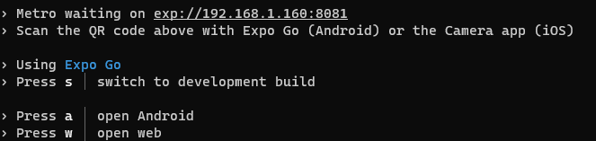

## Deploy the APC demo application

This section provides a step-by-step guide to get the project up and running on your local machine and mobile device.

### Prerequisites
Before starting, ensure you have the following installed:

- **Azure Subscription**: Access to an Azure subscription is necessary to deploy resources necessary for this app to work. If you don't have one, you can create a [free account](https://azure.microsoft.com/free/).

- **APC Public Preview Access**: To create an APC Gateway, you must be signed up for the public preview of Azure Programmable Connectivity. If you have not already done so, please register using the form available at [APC Public Preview Signup](https://aka.ms/APCpublicpreview).
- Git
- Node.js
- Azure CLI installed on your machine
- .NET SDK 8 installed on your machine

## APC Gateway deployment and configuration

#### Create APC Gateway Instance

Before you proceed with creating an APC Gateway instance, ensure you have completed all prerequisites outlined in the [prerequisites section](#prerequisites). This includes signing up for the APC Public Preview, which is necessary for the APC Gateway to be available in your Azure portal.

* Follow the official [APC guide - How to create a Gateway](https://learn.microsoft.com/azure/programmable-connectivity/azure-programmable-connectivity-create-gateway) to create a gateway, or have one already.
* Once you are done creating the gateway, note down the APC Gateway resoruce id endpoint, as explained in this section.

Deploying an APC Gateway in Azure is a straightforward process that involves the following steps:

1. **Open Azure Portal**: Navigate to [Azure Portal](https://portal.azure.com/) and log in with your credentials.

1. **Search for `APC Gateways`** and then select **Create**. If the APC Gateway does not appear as an available resource, please revisit the [prerequisites section](#prerequisites) and ensure you have successfully registered for the [APC public preview](https://aka.ms/APCpublicpreview).

   
2. Select your **Subscription**, **Resource Group**, and **Region**.

   

3. Provide a unique **Name** for your gateway and proceed to the next steps.

Once your gateway is created, you'll need to configure it:

1. Assign the telecom operator setup, selecting the SimSwap, Location and Number Verification APIs and plans.

2. Complete the application details, which will be shared with the operator for validation.

   

3. Agree to the operators' terms and conditions to finalize the setup.

Now, note down relevant resource information for later steps:

1. Navigate to your APC Gateway resource in the Azure portal and copy the `resource Id` and the `endpoint` value:

   

#### Set up authentication

To authenticate and access the APC Gateway, create a Microsoft Entra application in the same directory or tenant.

1. Follow the instructions to [register an application with Microsoft Entra ID](https://learn.microsoft.com/en-us/entra/identity-platform/howto-create-service-principal-portal), create a service principal and record the clientId and secret.
    1. Sign in to the [Microsoft Entra admin center](https://entra.microsoft.com) as at least a **Cloud Application Administrator**. 
    1. Browse to **Identity** > **Applications** > **App registrations** then select **New registration**.
    1. Name the application, for example "apc-hol-exercise". 
    1. Select a supported account type, which determines who can use the application. For the exercises in this lab it won´t matter since we are using a client credentials flow with Client Id and secret.
    1. Select **Register**.

    

2. Create and record the application client ID and client secret or certificate for future use.
    1. Browse to **Identity** > **Applications** > **App registrations**, then select your application.
    1. Select **Certificates & secrets**.
    1. Select **Client secrets**, and then Select **New client secret**.
    1. Provide a description of the secret, and a duration.
    1. Select **Add**.

   

3. Assign the necessary role to interact with the APC Gateway to your application by running the following Azure CLI command. Replace or assign values to `$SUB_ID` with your subscription id, `$RG_NAME` with resource group name where the APC Gateway resource is and `$GATEWAY_NAME` for and the APC Gateway resource name. Replace `$APP_ID` with the client Id from the authentication step. Log in using `az login` if you have to:

   ```sh
   az role assignment create --role 609c0c20-e0a0-4a71-b99f-e7e755ac493d
   --scope /subscriptions/$SUB_ID/resourceGroups/$RG_NAME/providers/Microsoft.ProgrammableConnectivity/gateways/$GATEWAY_NAME
   --assignee $APP_ID
   ```


## Backend configuration and deployment

### Build and configure the backend service locally

#### Run the backend locally

1. **Clone the Project**
   ```
   git clone https://github.com/MSFT-SMT-ACCELERATORS/APC-Demo-App.git
   ```

2. **Navigate to the Backend Service Directory**
   ```
   cd [Repo path]/APC.Proxy.API
   ```
3. update up the `appsettings.Development.json` file with the necessary configurations:

   ```json
   {
      "APCClientSettings": {
      "AuthAppCredentials": {
         "ClientId": "your-client-id",
         "TenantId": "your-tenant-id",
         "ClientSecret": "your-client-secret"
      },
      "GatewayId": "your-gateway-id",
      "BaseUri": "https://your-apc-endpoint"
      }
   }
   ```

   Find more information on the application settings for this app in the [implementation details file](leaves-implementation-details.md)

4. **Build the Project**
   ```
   dotnet build
   ```

5. **Run the Backend Service**
   ```
   dotnet run --project APC.ProxyServer
   ```

6. **Open the swagger UI url int the browser for testing**. Make sure the port is correct and the uri is HTTP, not HTTPS.
   
   

   ```
      http://localhost:5009/swagger/index.html
   ```

   
   
### Deploy and configure the backend in Azure Cloud

#### Step 1: Create an Azure Web App

1. **Log in to the Azure Portal** at https://portal.azure.com.
2. **Navigate to "App Services"** and click on **+ Create** to start the process of creating a new app service.

   

3. **Select your subscription** and choose or create a new resource group.
4. **Enter the name** for your web app (e.g., `apc-hol-leavesbank-service`).
5. **Publish**: Select **Code** as the method to publish the application.
6. **Runtime stack**: Choose **.NET 8**.
7. **Operating System**: Select your preferred OS (Windows or Linux).
8. **Region**: Choose the region that is closest to your users or other services.
9. **Pricing plan**: Create or select an existing pricing plan. For development use F1 Free shared plan or better.
10. **Review and create**: Review the configuration details, then click **Create** to provision and deploy the web app.

      

#### Step 2: Configure Application Settings in Azure

1. **Navigate to your newly created App Service** in the Azure portal.
2. **Go to "Configuration"** under the Settings section and **Click on "New application setting"** to add each of the following settings. You'll need to add the relevant values for `ClientId`, `TenantId`, `ClientSecret`, `GatewayId`, and `BaseUri`:

   - `APCClientSettings__AuthAppCredentials__ClientId`
   - `APCClientSettings__AuthAppCredentials__TenantId`
   - `APCClientSettings__AuthAppCredentials__ClientSecret`
   - `APCClientSettings__GatewayId`
   - `APCClientSettings__BaseUri`

   

3. **Set CORS**: In the portal, navigate to "CORS" under the API section. Add `*` to allow all domains or specify your domain to restrict the cross-origin requests to your front end. **Save** the configurations to apply them,

   


#### Step 3: Deploy the Backend Code Using Azure CLI

Use an IDE such as [Visual Studio Code](https://learn.microsoft.com/en-us/aspnet/core/tutorials/publish-to-azure-webapp-using-vscode?view=aspnetcore-8.0#publish-to-azure), [Visual Studio](https://learn.microsoft.com/en-us/visualstudio/deployment/quickstart-deploy-aspnet-web-app?view=vs-2022&tabs=azure) or similar to deploy to the newly created web app or follow these steps to do it with Azure CLI:

1. **Login and set Azure Subscription.** Replace `<subscription-name-or-id>` with your actual subscription name or ID.

   ```bash
   az login
   az account set --subscription "<subscription-name-or-id>"
   ```

2. **Publish the Application.** Navigate to the directory containing the `APC.ProxyServer` project and publish it using the following command:

   ```bash
   dotnet publish ./APC.ProxyServer/APC.ProxyServer.csproj -c Release -o ./publish
   ```

This command compiles the application in the Release configuration and outputs the files to the `./publish` directory.

3. **Package the published files into a ZIP file for deployment.** Run this command in the directory where the `publish` folder is located:

   ```powershell
   Compress-Archive -Path "./publish/*" -DestinationPath "./publish.zip"
   ```

4. **Deploy to Azure WebApp**
Use the Azure CLI to upload and deploy the ZIP file to your Azure WebApp. Replace `rg-HOL-lab` with your resource group name and `apc-hol-leavesbank-service` with your WebApp name.

   ```bash
   az webapp deployment source config-zip --resource-group rg-HOL-lab --name apc-hol-leavesbank-service --src "./publish.zip"
   ```

5. Once done, **Open the swagger UI url in the browser for verification**
   ```
   https://YOUR-WEB-APP-UI.azurewebsite.net/swagger/index.html
   ```


## Client app local Setup and Testing

### Build, configure and run the client app

To set up and run the project locally, follow these steps:

1. **Create an Expo Account**
   - Visit [Expo](https://expo.dev/signup) and sign up for an account.
   - After signing up, verify your email to activate your account.

2. **Login via Terminal**
   - Open your terminal and run the following command to login to your Expo account:
     ```
     npx expo login
     ```
   - Enter your Expo credentials when prompted.

3. **Navigate to the React Native App Directory**
   ```
   cd [Repo path]/APC.MobileApp/ReactNative
   ```

4. **Install Dependencies**
   ```
   npm install
   ```

5. **Create a Bing Maps Key** follow [this guide](https://learn.microsoft.com/en-us/bingmaps/getting-started/bing-maps-dev-center-help/getting-a-bing-maps-key)
   - Visit the [Bing Maps Dev Center](https://www.bingmapsportal.com/).
   - If you have a Bing Maps account, sign in with the Microsoft account that you used to create the account or [create a new one](https://learn.microsoft.com/en-us/bingmaps/getting-started/bing-maps-dev-center-help/creating-a-bing-maps-account).
   - Under "My account" menu, select "My keys".
   - Click on "Create a new key".
   - Fill out the form to create a key. Use the following settings:
      - **Application name**: Provide a name for your application.
      - **Application URL**: You can leave this blank.
      - **Key type**: Choose `Basic`.
      - **Application type**: Select the most appropriate type for your project, such as `Mobile Application`.
   - Submit the form and copy your new Bing Maps Key.
   

6. **Configure Environment Variables for Expo**
   - Create a `.env` file in the root directory of the React Native project (*src/APC.MobileApp/ReactNative*).
   - Set `API_URL` with the Azure App Service URI for the backend service APC Proxy you deployed in an earlier step, or the local address if testing the backend locally.
   - Set `BING_KEY` with the Bing Maps API key you just generated.

   ```
   API_URL=your-app-service-uri
   BING_URL=https://dev.virtualearth.net/REST/v1
   BING_KEY=your-bing-api-key
   ```

   

7. **Start the Application**
   ```
   npm start
   ```

8. **Open in a Web Browser**
   - Once the process is complete, the Metro Bundler should be running in your terminal. Press `W` to open the app in your web browser. Use responsive mode when opening the developer console with F12.

   
   

### Run the app on Mobile

To test the app on a mobile device, follow these additional steps:

1. **Download Expo Go App**
   - Install the Expo Go application from your device's app store (available on iOS and Android) and sign in using your Expo account.

2. **Open on Mobile**
   - Open the Expo Go app on your mobile device.
   - If you are using an **iOS** device, select the available development server named `Microsoft APC Demo on - YOUR SYSTEM NAME`:
      

   - If you are using an **android** device, select the option to scan the QR code.
      

   - Scan the QR code that appears in your terminal after you've run `npm start` from the React Native app directory.
      


This will open the app on your mobile device, allowing you to test its features in a mobile environment using your local devopment server.

### Deploy the app on App Store and Play Store

Deploying your mobile app on the App Store and Play Store involves several steps, including enrolling in developer programs, preparing your app for release, and submitting it for review. Here's a high-level overview of the process for each platform:

#### App Store (iOS)
1. **Enroll in the Apple Developer Program**: To distribute your app on the App Store, you must be a member of the [Apple Developer Program](https://developer.apple.com/programs/). There is an annual fee associated with this membership.
2. **Prepare Your App for Submission**: Use Xcode to archive and upload your app. Ensure that you have tested it thoroughly, have all necessary app metadata, and have complied with Apple's [App Store Review Guidelines](https://developer.apple.com/app-store/review/guidelines/).
3. **TestFlight**: Before submitting your app for review, you may want to distribute it to testers using [TestFlight](https://developer.apple.com/testflight/), which allows you to collect valuable feedback and make improvements.
4. **Submit Through App Store Connect**: Once your app is ready, submit it through [App Store Connect](https://appstoreconnect.apple.com/). After submission, your app will undergo Apple's review process before it can go live on the App Store.

#### Play Store (Android)
1. **Register for a Google Play Developer Account**: You need to create a [Google Play Developer account](https://play.google.com/apps/publish/signup/) to publish apps on the Play Store. This requires a one-time registration fee.
2. **Prepare and Build Your App for Release**: Ensure your app meets Google's [Launch checklist](https://developer.android.com/distribute/best-practices/launch/launch-checklist). This includes setting the version information, configuring APK or App Bundle, and defining the app's content rating.
3. **Test with Google Play’s Internal Testing**: Before going public, you can use Google Play’s internal testing features to distribute your app to up to 100 testers to gather feedback and make any necessary adjustments.
4. **Publish Your App on Google Play Console**: Upload your APK or App Bundle to the Google Play Console and fill in the listing details. Then, submit your app for review. Once approved, it will be available on the Google Play Store.
