# Azure Programmable Connectivity (APC) Hands-On Lab

Welcome to the Azure Programmable Connectivity Hands-On Lab. In this lab, we will explore the powerful features of APC that enable developers to integrate telecom operator services directly into their applications. This lab is designed to give you practical experience with APC, taking you from the basics of setup and testing to advanced integration scenarios.

### Suggested Timeline
| Time    | Activity |
| ------- | -------- |
| 10 min  | [Introduction to Azure Programmable Connectivity (APC)](#introduction-to-azure-programmable-connectivity-apc) |
| 30 min  | **Part 1:** [Get Started with APC](#part-1-get-started-with-apc)   |
|         | [Use Network APIs with the APC SDK Client](#use-network-apis-with-the-apc-sdk-client) |
|         | [Use Network APIs with APC REST APIs](#use-network-apis-with-apc-rest-apis) |
|  1 hour | **Part 2:** [Advanced Use Case - Integrating APC into a Banking App](#part-2-advanced-use-case---integrating-apc-into-a-banking-app) |
|         | [Architecture](#architecture) |
|         | [Exercise: Deploying and Testing a Demo Banking Application](#exercise-deploying-and-testing-a-demo-banking-application) |
|         | [Advanced Integration Details](#advanced-integration-details) |
| 30 min  | [Annex](#annex) (optional)   |


- **Part 1** of this lab is designed to give you a swift yet comprehensive introduction to APC, equipping you with the knowledge to deploy an APC Gateway and make initial API calls. It's ideal for learners who are new to APC or require a quick start guide for incorporating APC into their applications.

- **Part 2** provides a deeper dive into APC's real-world applications. It's ideal for those looking to understand the intricacies APC application, integration into frontend and backend services, along with some Network API-specific caveats. This section is recommended for anyone interested in the technical implementation of APC. 


### Complete index

- [Introduction](#introduction-to-azure-programmable-connectivity-apc)
  - [Overview of APC](#overview-of-apc)
  - [Architecture](#architecture)
  - [APC Planned Operator APIs](#apc-planned-operator-apis)
  - [Additional Information](#additional-information)
- **Part 1:** [Get Started with APC](#part-1-get-started-with-apc)
  - [Prerequisites](#prerequisites)
    - [Create APC Gateway Instance](#create-apc-gateway-instance)
    - [Set up Authentication](#set-up-authentication)
  - [Use Network APIs with the APC SDK Client](#use-network-apis-with-the-apc-sdk-client)
    - [Create a Console Application](#create-a-console-application)
    - [Install the APC SDK](#install-the-apc-sdk)
    - [Instantiate an Authenticated Client](#instantiate-an-authenticated-client)
    - [Make APC SDK Requests](#make-apc-sdk-requests)
      - [APC Call: Retrieve Network Information](#apc-sdk-retrieve-network-information)
      - [APC Call: Sim Swap Retrieve/Verify](#apc-sdk-sim-swap-retrieveverify)
  - [Use Network APIs with APC REST APIs](#use-network-apis-with-apc-rest-apis)
    - [Postman APC requests](#a-make-apc-requests-with-postman)
      - [Postman APC SimSwap Verify Request](#postman-apc-simswap-verify-request)
      - [Postman APC Number Verification Request](#postman-apc-number-verification-request)
    - [.NET HttpClient APC requests](#b-make-apc-requests-with-net-httpclient)
      - [HttpClient APC Retrieve Network Information Request](#http-apc-call-1-retrieve-network-information)
      - [HttpClient APC Verify Sim Swap Request](#http-apc-call-2-verify-sim-swap)
- **Part 2:** [Advanced Use Case - Integrating APC into a Banking App](#part-2-advanced-use-case---integrating-apc-into-a-banking-app)
  - [Architecture](#architecture)
  - [Exercise: Deploying and Testing a Demo Banking Application](#exercise-deploying-and-testing-a-demo-banking-application)
  - [Advanced Integration Details](#advanced-integration-details)
    - [React Service Calling APC](#react-service-calling-apc)
    - [APC Proxy SDK Usage](#apc-proxy-sdk-usage)
    - [Dependency Injection for SDK + HttpClient](#dependency-injection-for-sdk--httpclient)
    - [Handling Consent Permission for Location Number Verification](#handling-consent-permission-for-location-number-verification)
    - [Handling Redirections for Number Verification](#handling-redirections-for-number-verification)
- [Annex](#annex)
  - [Network APIs](#network-apis)
    - [Device Network Retrieval](#device-network-retrieval)
    - [SIM Swap Detection](#sim-swap-detection)
    - [Number Verification](#number-verification)
    - [Device Location Verification](#device-location-verification) 
  - [Additional REST APC calls using .NET HttpClient](#additional-rest-apc-calls-using-net-httpclient)
    - [Location REST APC calls using .NET HttpClient](#location-rest-apc-calls-using-net-httpclient)
    - [Number Verification REST APC calls using .NET HttpClient](#number-verification-rest-apc-calls-using-net-httpclient)
  - [Additional REST APC calls using Postman](#additional-rest-apc-calls-using-postman)
    - [Location REST APC calls using Postman](#location-rest-apc-calls-using-postman)
    - [Number Verification REST APC calls using Postman](#number-verification-rest-apc-calls-using-postman)
  - [.NET HttpClient APC requests](#b-make-apc-requests-with-net-httpclient)
    - [HttpClient APC Verify Device Location Request](#http-apc-call-2-verify-device-location)
    - [HttpClient APC Number Verification Request](#http-apc-call-4-number-verification)


## Introduction to Azure Programmable Connectivity (APC)

### Overview of APC

Azure Programmable Connectivity (APC) is an Azure service that connects cloud applications to mobile operator networks APIs. It offers a streamlined method to access an array of operator network services, simplifying the use of telecommunications capabilities like SIM swap detection and location-based services through easy-to-implement APIs


### Architecture

 Here’s a high-level view of the typical architecture:

- **Application Clients**: (Client App Innstance in diagram) These can range from Single Page Applications (SPAs) to mobile apps or any other client-side applications. They are the consumer-facing end of the system, interacting with the application service to perform various tasks like SIM swap checks or retrieving location data.

- **Application Service**: (Application Backend in diagram) This is the backend that your application clients communicate with. It is responsible for processing client requests, handling business logic, and making authenticated calls to the APC Gateway. This service can be hosted on cloud platforms like Azure or on-premises.

- **APC Gateway**: Hosted on Azure, the APC Gateway is an intermediary that securely connects to multiple operator networks. It translates the requests from the application service into the specific protocols, authentication and data formats that telecom operators require.

- **Operator Network APIs**: These are the services and APIs provided by telecom operators, which offer functionality such as number verification, SIM swap detection, and user location services. APC abstracts the complexities of these operator-specific APIs, presenting a unified and standardized interface for the application service to interact with.

Here is an overview diagram depicting the interaction between these components:

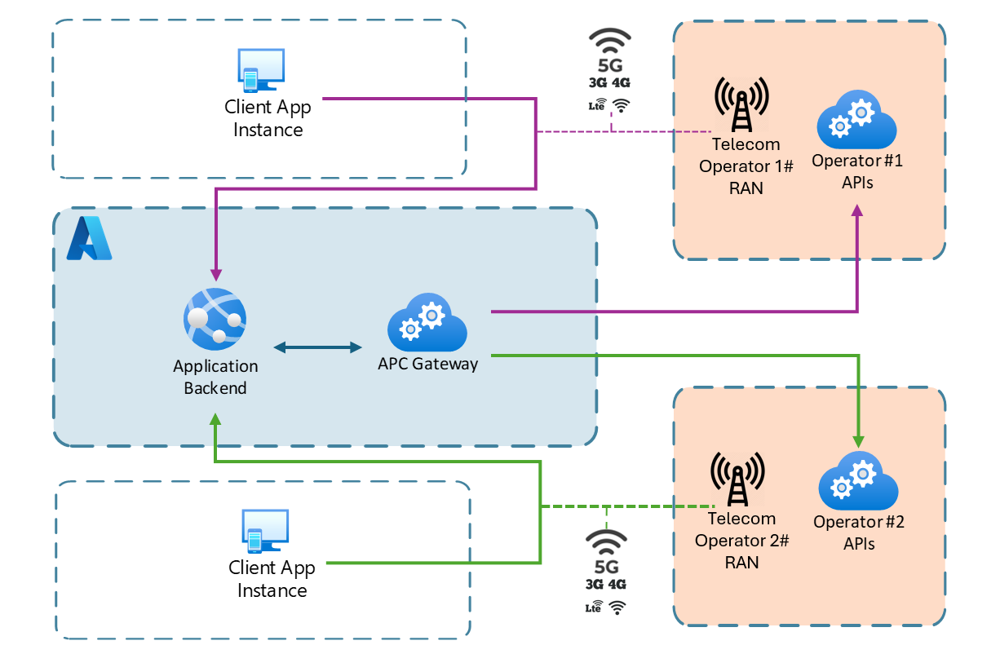

### APC Planned Operator APIs

APC provides direct access to a range of operator APIs, designed to streamline complex telecom functionalities into developer-friendly services. Below is a table summarizing the currently supported and planned operator APIs:

**Initial Focus: Anti-fraud Network APIs**

| API                         | Description                                                                                   |
|-----------------------------|-----------------------------------------------------------------------------------------------|
| [SIM Swap Detection](#sim-swap-detection) | Checks the last time a SIM was swapped, crucial for fraud prevention. Alerts if a SIM swap has occurred recently, indicating potential fraud. |
| [Number Verification](#number-verification) | Validates phone numbers to authenticate mobile devices seamlessly, reducing the need for SMS one-time passwords and enabling faster, more secure login and registration processes. |
| [Device Location Verification](#device-location)   | Validates the geographical location of devices using network technologies. Offers precise location tracking, enhancing anti-fraud measures. |


**Near Future Focus**

| API                 | Description                                                                                   |
|---------------------|-----------------------------------------------------------------------------------------------|
| Quality of Demand   | Ensures prioritized network traffic for essential services, maintaining performance standards. |
| Carrier Billing     | Facilitates direct carrier billing capabilities, enabling seamless transactions.               |
| Discover Optimal Latency Endpoint | Optimizes connectivity by identifying the best endpoint based on latency.                      |

Find detailed information about each [Network API](#network-apis) in the annex.

### Additional information

For a deeper understanding of Azure Programmable Connectivity (APC), including its potential impact and further details on its capabilities, refer to the following resources:

- [APC annoucement blogpost with additional resources](https://techcommunity.microsoft.com/t5/azure-for-operators-blog/azure-programmable-connectivity-empowering-the-next-generation/ba-p/4063967)

- [Microsoft Learn: APC Overview](https://learn.microsoft.com/en-us/azure/programmable-connectivity/azure-programmable-connectivity-overview)

- [APC Product Page](https://azure.microsoft.com/en-us/products/programmable-connectivity/)


## Part 1: Get Started with APC

### Contents

  - [Prerequisites](#prerequisites)
    - [Create APC Gateway Instance](#create-apc-gateway-instance)
    - [Set up Authentication](#set-up-authentication)
  - [Use Network APIs with the APC SDK Client](#use-network-apis-with-the-apc-sdk-client)
    - [Create a Console Application](#create-a-console-application)
    - [Install the APC SDK](#install-the-apc-sdk)
    - [Instantiate an Authenticated Client](#instantiate-an-authenticated-client)
    - [Make APC SDK Requests](#make-apc-sdk-requests)
      - [APC Call: Retrieve Network Information](#apc-sdk-retrieve-network-information)
      - [APC Call: Sim Swap Retrieve/Verify](#apc-sdk-sim-swap-retrieveverify)
  - [Use Network APIs with APC REST APIs](#use-network-apis-with-apc-rest-apis)
    - [Postman APC requests](#a-make-apc-requests-with-postman)
      - [Postman APC SimSwap Verify Request](#postman-apc-simswap-verify-request)
      - [Postman APC Number Verification Request](#postman-apc-number-verification-request)
    - [.NET HttpClient APC requests](#b-make-apc-requests-with-net-httpclient)
      - [HttpClient APC Retrieve Network Information Request](#http-apc-call-1-retrieve-network-information)
      - [HttpClient APC Verify Sim Swap Request](#http-apc-call-2-verify-sim-swap)

(Optional annex sections) 
  - [Additional REST APC calls using .NET HttpClient](#additional-rest-apc-calls-using-net-httpclient)
    - [Location REST APC calls using .NET HttpClient](#location-rest-apc-calls-using-net-httpclient)
    - [Number Verification REST APC calls using .NET HttpClient](#number-verification-rest-apc-calls-using-net-httpclient)
  - [Additional REST APC calls using Postman](#additional-rest-apc-calls-using-postman)
    - [Location REST APC calls using Postman](#location-rest-apc-calls-using-postman)
    - [Number Verification REST APC calls using Postman](#number-verification-rest-apc-calls-using-postman)
  - [.NET HttpClient APC requests](#b-make-apc-requests-with-net-httpclient)
    - [HttpClient APC Verify Device Location Request](#http-apc-call-2-verify-device-location)
    - [HttpClient APC Number Verification Request](#http-apc-call-4-number-verification)

### Prerequisites

Before starting your journey with Azure Programmable Connectivity (APC), make sure you have the following prerequisites ready:

- **Azure Subscription**: Access to an Azure subscription is necessary to deploy resources necessary for this app to work. If you don't have one, you can create a [free account](https://azure.microsoft.com/free/).

- **APC Public Preview Access**: To create an APC Gateway, you must be signed up for the public preview of Azure Programmable Connectivity. If you have not already done so, please register using the form available at [APC Public Preview Signup](https://aka.ms/APCpublicpreview).

- **Azure CLI and PowerShell**: Familiarity with Azure CLI or PowerShell is essential for deploying resources and automation scripting.

- **Development Environment**: Set up your preferred IDE or code editor, such as Visual Studio Code or Visual Studio, configured for console app development.

- **Cellular Network Connection**: Ensure that your development environment is connected to a supported cellular network. This could be via a mobile hotspot connection from a mobile device or through a 4G/5G router equipped with a SIM card. [Read more about supported cellular connections for these exercises](#network-limitations).

#### Create APC Gateway Instance

Before you proceed with creating an APC Gateway instance, ensure you have completed all prerequisites outlined in the [prerequisites section](#prerequisites). This includes signing up for the APC Public Preview, which is necessary for the APC Gateway to be available in your Azure portal.

* Follow the [guide](https://learn.microsoft.com/azure/programmable-connectivity/azure-programmable-connectivity-create-gateway) to create a gateway, or have one already.
* Once you are done creating the gateway, note down the APC Gateway resoruce id endpoint, as explained in this section.

Deploying an APC Gateway in Azure is a straightforward process that involves the following steps:

1. **Open Azure Portal**: Navigate to [Azure Portal](https://portal.azure.com/) and log in with your credentials.

1. **Search for `APC Gateways`** and then select **Create**. If the APC Gateway does not appear as an available resource, please revisit the [prerequisites section](#prerequisites) and ensure you have successfully registered for the [APC public preview](https://aka.ms/APCpublicpreview).

2. Select your **Subscription**, **Resource Group**, and **Region**.

  

3. Provide a unique **Name** for your gateway and proceed to the next steps.

Once your gateway is created, you'll need to configure it:

1. Assign the telecom operator setup for the cellular network you'll be using and selecting the the Network API plans for:

    - Location
    - SIM Swap
    - Number Verification

    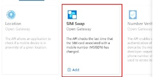

2. Complete the application details, which will be shared with the operator for validation.

   

3. Agree to the operators' terms and conditions to finalize the setup.

Now, note down relevant resource information for later steps:

1. Navigate to your APC Gateway resource in the Azure portal and copy the `resource Id` and the `endpoint` value:

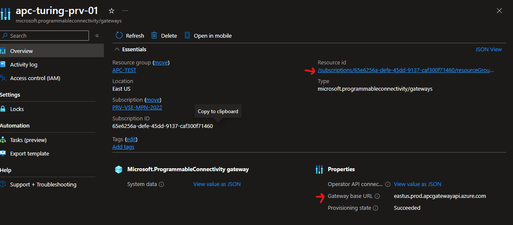

#### Set up authentication

To authenticate and access the APC Gateway, create a Microsoft Entra application in the same directory or tenant.

1. Follow the instructions to [register an application with Microsoft Entra ID](https://learn.microsoft.com/en-us/entra/identity-platform/howto-create-service-principal-portal), create a service principal and record the clientId and secret.
    1. Sign in to the [Microsoft Entra admin center](https://entra.microsoft.com) as at least a **Cloud Application Administrator**. 
    1. Browse to **Identity** > **Applications** > **App registrations** then select **New registration**.
    1. Name the application, for example "apc-hol-exercise". 
    1. Select a supported account type, which determines who can use the application. For the exercises in this lab it won´t matter since we are using a client credentials flow with Client Id and secret.
    1. Don´t specify any return URI as it´s not needed for these HOL exercises.
    1. Select **Register**.

    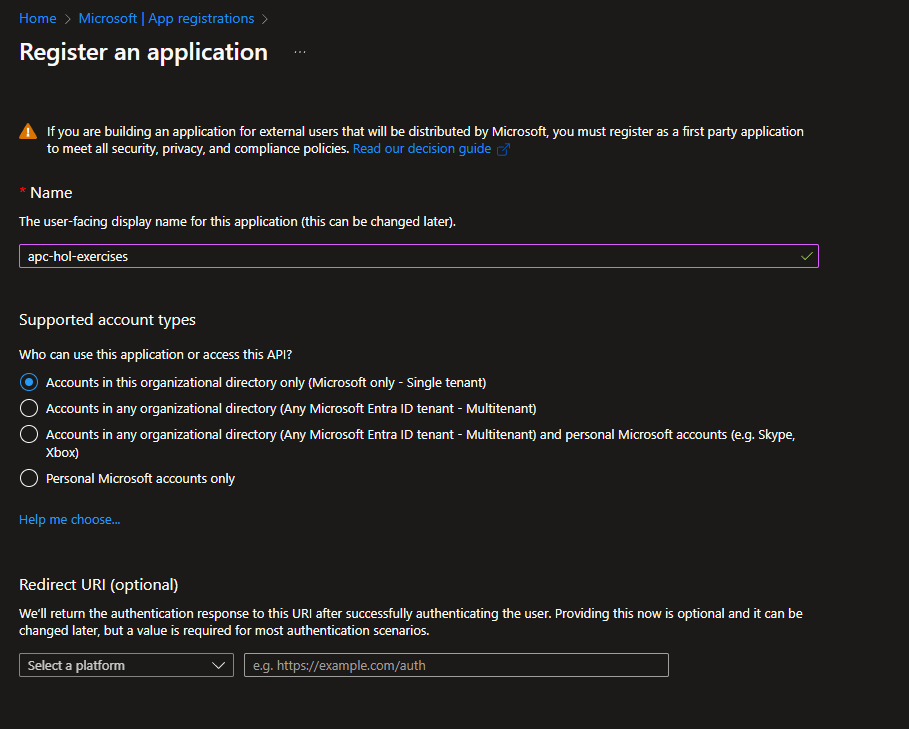

2. Create and record the application client ID and client secret or certificate for future use.
    1. Browse to **Identity** > **Applications** > **App registrations**, then select your application.
    1. Select **Certificates & secrets**.
    1. Select **Client secrets**, and then Select **New client secret**.
    1. Provide a description of the secret, and a duration.
    1. Select **Add**.

        

3. Assign the necessary role to interact with the APC Gateway to your application by running the following Azure CLI command. Replace or assign values to `$SUB_ID` with your subscription id, `RG_NAME` with resource group name where the APC Gateway resource is and `$GATEWAY_NAME` for and the APC Gateway resource name. Log in using `az login` if you have to:

    ```sh
    az role assignment create --role 609c0c20-e0a0-4a71-b99f-e7e755ac493d
    --scope /subscriptions/$SUB_ID/resourceGroups/$RG_NAME/providers/Microsoft.ProgrammableConnectivity/gateways/$GATEWAY_NAME
    --assignee $APP_ID
    ```

### Use Network APIs with the APC SDK Client

The APC SDK simplifies making API calls by providing strongly typed methods for each APC service. Here's how to get started:

#### Create a Console Application

To start using the Azure Programmable Connectivity (APC) SDK, you'll need to create a new console application. This application will serve as the foundation for integrating with APC services.

1. Open your IDE or code editor.
2. Create a new .NET 8 console application project.
3. Name your project appropriately to reflect its purpose, such as `APCIntegration`.

#### Install the APC SDK

With your project created, the next step is to install the APC SDK:

1. Use the NuGet Package Manager to find a prerelease NuGet by checking `Include prerelease` checkbox and search for `Azure.Communication.ProgrammableConnectivity`. Install the latest version of the SDK to your project.

    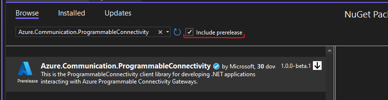
    
2. or use dotnet CLI to install the NuGet Package from the project folder path:

    ```sh
    dotnet add package Azure.Communication.ProgrammableConnectivity --prerelease
    ```

#### Instanciate an authenticated client

The client library uses [`Azure.Identity`](https://learn.microsoft.com/dotnet/api/azure.identity?view=azure-dotnet) credentials to authenticate with APC. 

1. Install Azure.Identity nugget package with the Nuget Package Manager or with the following command. (Uncheck `Include prerelease` checkbox):

    ```sh
    dotnet add package Azure.Identity
    ```

    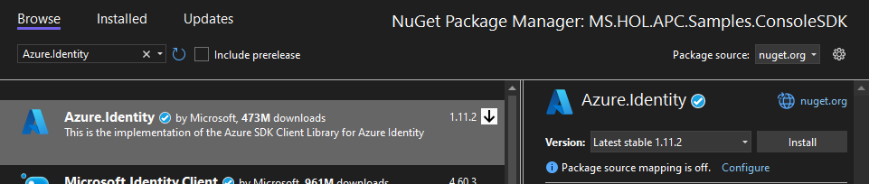

2. In Program.cs, create values for the recorded APC Gateway information and Entra client credentials from earlier steps.

    ```csharp
    // Setup your APC endpoint and gateway resource id here
    var apcEndpoint = "https://eastus.prod.apcgatewayapi.azure.com";
    var apcGatewayId = "/subscriptions/$your-subscription-id/resourceGroups/$your-resource-group/providers/Microsoft.programmableconnectivity/gateways/$your-gateway-name";

    // Your Azure Entra application's details
    var clientId = "your-application-client-id";
    var clientSecret = "your-application-client-secret";
    var tenantId = "your-tenant-id";
    ```

3. Obtain client credential by implementing this authentication logic in your application using the noted clientId and clientSecret from the authentication section in prerequisites.

    ```csharp
    // Instantiate the auth client credential
    TokenCredential credential = new ClientSecretCredential(tenantId, clientId, clientSecret);
    ```

3. Instanciate the SDK client using:

    ```csharp
    // Instantiate the APC client
    ProgrammableConnectivityClient apcClient = new ProgrammableConnectivityClient(new(apcEndpoint), credential));
    ```
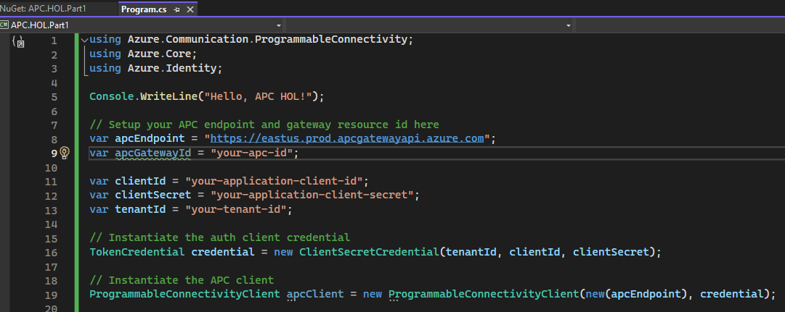


#### Make APC SDK requests

For each call that you make to APC with the SDK, you will follow the same pattern:
* Create a client `apcClient = new ProgrammableConnectivityClient()`
* Access the sub-client for your use case (sim-swap/location/number-verification/device-network) by calling say `apcClient.GetSimSwapClient()`
* Create the content for your request by using the objects given by the SDK, for example `SimSwapVerificationContent`
* Call the client with the content you've created
* Access the result

**Reminder:** As noted in the prerequisites, make sure that your device is connected to a cellular network (via a mobile hotspot or a 4G/5G router with a SIM card) while performing these requests. This is crucial for successfully testing and validating features that require real network interactions, such as device network retrieval or number verification.

##### APC SDK: Retrieve Network Information

To make APC operator API calls, you'll need the network identifier for the cellular network device address you are calling from. More informtion on this APC Call: [Device Network](#device-network).


1. Access the subclient for the device network from the base client created earlier `apcClient`:

    ```csharp
    // Retrieve network information
    var deviceNetworkApcClient = apcClient.GetDeviceNetworkClient();
    ```

2. **Retrieve the Local IP Address:** Add code to dynamically retrieve the IP address of the network interface that is up and running and not a loopback interface.

    ```csharp
    // Retrieve the local IP address dynamically
    var host = Dns.GetHostEntry(Dns.GetHostName());
    var localIP = host.AddressList.FirstOrDefault(ip => ip.AddressFamily == System.Net.Sockets.AddressFamily.InterNetwork);
    ```


2. Create the device-network request content using the SDK class `Networkidentifier`. Use the previously obtained public ip. APC will identify which operator network is managing it:

    ```csharp
    var networkIdentifier = new NetworkIdentifier("IPv4", localIP.ToString());
    ```

3. Retrieve the device-network response:

    ```csharp
    Response<NetworkRetrievalResult> networkResponse = deviceNetworkApcClient.Retrieve(apcGatewayId, networkIdentifier);
    Console.WriteLine($"Network Identifier result: {networkResponse.Value}");
    ```

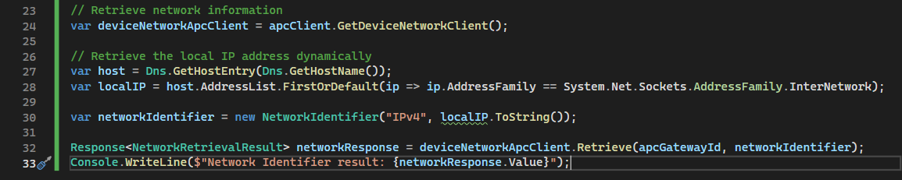


##### APC SDK: Sim Swap retrieve/verify

Once you have the client configured and retrieved the network identifier, proceed to make a Sim Swap verification request. This call will check whether the SIM card you are using for the cellular network has been replaced recently.For more informtion on this APC Call: [Sim Swap Detection](#sim-swap-detection). 

1. Create the sim-swap request content using the SDK class `SimSwapVerificationContent`. PhoneNumber `phone-number` with your actual number associated with the cellular network you are using. Include the country code. You should have the cellular network identifier in the previous request:

    ```csharp
    // Retrieve SIM swap verification
    SimSwapVerificationContent simSwapContent = new SimSwapVerificationContent(new NetworkIdentifier("NetworkCode", networkResponse.Value.NetworkCode))
    {
        PhoneNumber = "+00number-with-countrycode",
        MaxAgeHours = 240
    };
    ```

2. Add code to access the subclient for sim-swap from the base client created earlier `apcClient`:

    ```csharp
    var simSwapApcClient = apcClient.GetSimSwapClient();
    ```

3. Retrieve the device-network response:

    ```csharp
    Response<SimSwapVerificationResult> response = client.Verify(ApcGatewayId, content);
    Console.WriteLine($"Verification result: {response.Value.VerificationResult}");
    ```

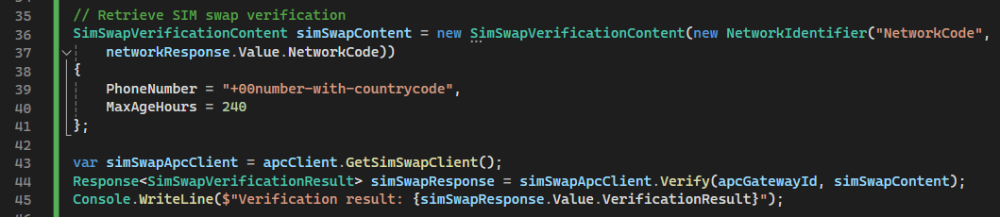

(OPTIONAL) If you wish to test more APC APIs using this method, find in the annex additional APC API calls with implementation details using the APC .NET SDK approach:

- [APC SDK: Device Location](#apc-sdk-device-location)
- [APC SDK: Number Verification ](#apc-sdk-number-verification)

### Use Network APIs with APC REST APIs

This section covers how to interact with Azure Programmable Connectivity (APC) using REST HTTP calls. You'll learn to set up Postman for making authenticated requests, and how to construct these requests using .NET HttpClient in a console application.

#### A. Make APC requests with Postman

To make authenticated requests to APC using REST HTTP calls, follow the process aided by the postman collection referenced in this guide.

- Make sure the collection has the authentication token properly configured. If this is not done prior to making a request or the token has expired (1 hour lifetime) the requests will return **HTTP 401 Unauthorized** results.
- Navigate to the desired APC request, for instance `sim-swap:verify`
- Create the content for your request by replacing the payload examples given in postman with your information
- Send the request
- Access the result

**Reminder:** As noted in the prerequisites, make sure that your device is connected to a cellular network (via a mobile hotspot or a 4G/5G router with a SIM card) while performing these requests. This is crucial for successfully testing and validating features that require real network interactions, such as device network retrieval or number verification.

##### Setup: Configure Postman for Authenticated Requests to APC

To make authenticated requests to the APC API, you need to set up Postman with the correct authorization headers. Here are the steps to configure Postman:

1. Open Postman, click import and drag the collection linked in this repo [Link to APC Postman collection](Azure%20Programmable%20Connectivity%20(APC)%20HOL.postman_collection.json)

    

2. Double click the collection name that appeared on the collection side menu and go to the tab `Variables`. From there, update the `auth-secret`, `auth-clientId`, `auth-tenantid` and also the `apc-id` and `endpont` values.

    

3. Click save or press `Ctrl+S` and go to the tab `Authorization`

    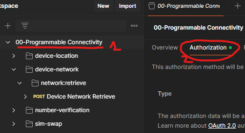

4. Scroll down to `Configure New Token` advanced section and click the button `Generate New Access Token`
    

5. Once succeeded, select `Use Token`. This token will be valid for 1 hour. You can skip to the Generate New Token step every time it expires.
    


##### Postman APC SimSwap Verify Request

To make APC operator API calls, you'll need the network identifier for the cellular network device address you are calling from. More informtion on this APC Call: [Device Netwrok](#device-network).

1. Navigate to `network:retrive` request

  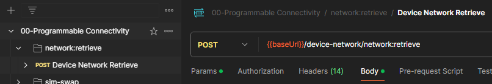

2. **Obtain Your Public IP Address**: Before adjusting the request payload, you need to obtain the public IP address of your cellular connection. You can do this by:
   
   - **Using Postman Echo Service**: Postman provides a free service that echoes the requests made to it. Send a request to `https://postman-echo.com/ip`, and it will return your public IP address. You can then copy this IP address into your APC request.
   
   - **Alternative Method**:
     If you prefer using an online tool, visit a website such as `https://www.whatismyip.com` from your device connected via the cellular network to find out your public IP address.

3. **Adjust the Request Payload in the `Body` Tab**
   With your public IP address in hand, adjust the payload under the `Body` tab of your request. Replace the `identifier` value with the IP address you obtained.

   **Body**:
   ```json
   {
       "identifierType": "IPv4",
       "identifier": "<your-public-IP-using-cellular-network>"
   }
    ```

    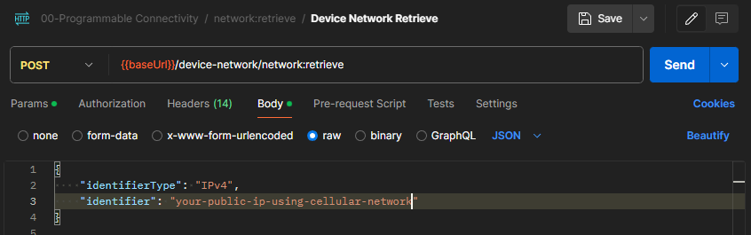

3. Click `Send` and view the response

    

##### Postman APC SimSwap Verify Request

1. Navigate to `sim-swap:verify` request

    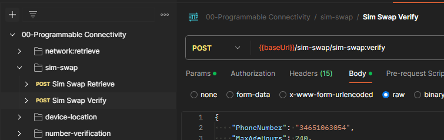

2. Adjust the request payload in the `Body` tab

    - For the `networkIdentifier.identifier` property should contain the result from the network retrieve request you made earlier.
    - `phoneNumber` property should contain the phone number including country code **you are using for cellular network connectiviy**.

More information on properties for this Network API: [Sim Swap Detection](#sim-swap-detection)

Here's an example for the request payload to perform a SIM Swap verify:

**Body**:
  ```json
  {
    "phoneNumber": "+1234567890",
    "networkIdentifier": {
      "identifierType": "NetworkCode",
      "identifier": "network-code-here"
    }
  }
  ```
  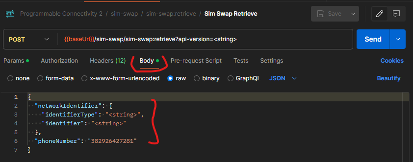

3. Click `Send` and view the response

  

#### B. Make APC requests with .NET HttpClient

You can also use the .NET HttpClient to make authenticated calls to APC. Here's a basic example of how you can implement this in a .NET 8 console application:

##### Set up a .NET httpClient for APC
1. Create a Console App project in Net8.0 in your preferred IDE.
2. In Program.cs, create values for the recorded APC Gateway information and Entra client credentials from earlier steps.

    ```csharp
    // Setup your APC endpoint and gateway resource id here
    var apcEndpoint = "https://eastus.prod.apcgatewayapi.azure.com";
    var apcGatewayId = "/subscriptions/$your-subscription-id/resourceGroups/$your-resource-group/providers/Microsoft.programmableconnectivity/gateways/$your-gateway-name";

    // Your Azure Entra application's details
    var clientId = "your-application-client-id";
    var clientSecret = "your-application-client-secret";
    var tenantId = "your-tenant-id";
    ```

3. Install Azure.Identity nugget package with the Nuget Package Manager or with the following command:

    ```sh
    dotnet add package Azure.Identity
    ```

    

4. Add the following code to Retrieve a token for your HttpClient.:
    ```csharp
    // Authentication with Azure AD to obtain Bearer Token.
    var credential = new ClientSecretCredential(tenantId, clientId, clientSecret);
    var token = await credential.GetTokenAsync(new Azure.Core.TokenRequestContext(new[] { "https://management.azure.com/.default" }));
    string accessToken = token.Token;
    ```

5. Add the required headers to call APC using a REST client:
    ```csharp
    // Prepare the HttpClient with the Bearer token and common headers.
    using var httpClient = new HttpClient();
    httpClient.BaseAddress = new Uri(baseUrl);
    httpClient.DefaultRequestHeaders.Add("apc-gateway-id", apcGatewayId);
    httpClient.DefaultRequestHeaders.Authorization = new AuthenticationHeaderValue("Bearer", accessToken);
    ```

Now you are ready to start calling APC API:


##### Http APC Call #1: Retrieve Network Information
To make APC operator API calls, you'll need the network identifier for the cellular network device address you are calling from. More informtion on this APC Call: [Device Netwrok](#device-network).


2. **Retrieve the Local IP Address:** Add code to dynamically retrieve the IP address of the network interface that is up and running and not a loopback interface.

    ```csharp
    // Retrieve the local IP address dynamically
    var host = Dns.GetHostEntry(Dns.GetHostName());
    var localIP = host.AddressList.FirstOrDefault(ip => ip.AddressFamily == System.Net.Sockets.AddressFamily.InterNetwork);
    ```

1. Prepare the network retrieve request content. Use the previously obtained public ip. APC will identify which operator network is managing it:

    ```csharp
    string networkApiUrl = $"{baseUrl}/device-network/network:retrieve";
    var networkIdentifier = new
    {
        identifierType = "IPv4",
        identifier = localIP.ToString()
    };
    var networkContent = new StringContent(JsonSerializer.Serialize(networkIdentifier), Encoding.UTF8, "application/json");
    ```

2. Create `NetworkRetrievalResult` class: This class will hold the result from the network retrieval call. You can place it at the end of Program.cs for simplicity.

    ```csharp
    public class NetworkRetrievalResult
    {
        public string NetworkCode { get; set; }
    }
    ```

3. Retrieve the device-network response:

    ```csharp
    HttpResponseMessage networkResponse = await httpClient.PostAsync(networkApiUrl, networkContent);
    var networkResult = await JsonSerializer.DeserializeAsync<NetworkRetrievalResult>(await networkResponse.Content.ReadAsStreamAsync(), new JsonSerializerOptions{PropertyNameCaseInsensitive = true});
    Console.WriteLine($"Network retrieval result: {networkResult}");
    ```
    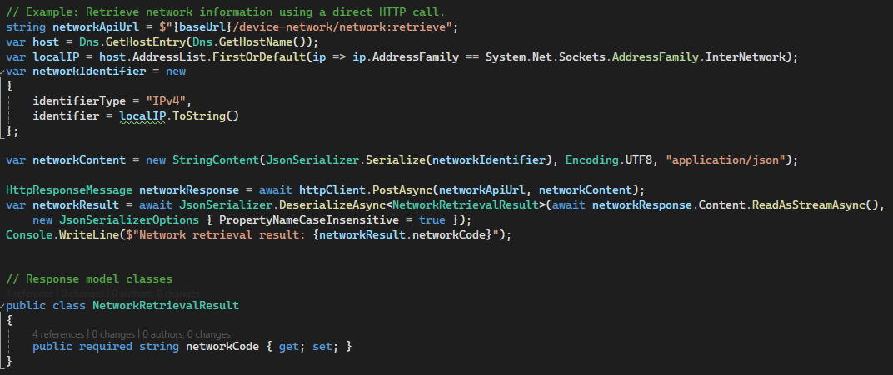

##### Http APC Call #2: Verify Sim Swap

Once you have the HTTP client configured and retrieved the network identifier, proceed to make a Sim Swap verification request. This call will check whether the SIM card you are using for the cellular network has been replaced recently. For more informtion on this APC Call: [Sim Swap Detection](#sim-swap-detection). 

1. Prepare the verify sim swap content:

    ```csharp
    string simSwapApiUrl = $"{baseUrl}/sim-swap/sim-swap:verify";
    var simSwapContent = new
    {
        phoneNumber = "your-phone-with-country-code",
        maxAgeHours = 240,
        networkCode = networkResult.networkCode
    };
    var simSwapRequestContent = new StringContent(JsonSerializer.Serialize(simSwapContent), Encoding.UTF8, "application/json");
    ```

2. Create `SimSwapVerificationResult` class: This class will hold the result from the sim swap verification call. You can place it at the end of Program.cs for simplicity.

    ```csharp
    public class SimSwapVerificationResult
    {
        public bool VerificationResult  { get; set; }
    }
    ```

3. Retrieve the verify sim swap response:
    ```csharp
    HttpResponseMessage simSwapResponse = await httpClient.PostAsync(simSwapApiUrl, simSwapRequestContent);
    var simSwapResult = await JsonSerializer.DeserializeAsync<SimSwapVerificationResult>(await simSwapResponse.Content.ReadAsStreamAsync(),
        new JsonSerializerOptions { PropertyNameCaseInsensitive = true });
    Console.WriteLine($"Sim swap verification result: {simSwapResult.VerificationResult}");
    ```
    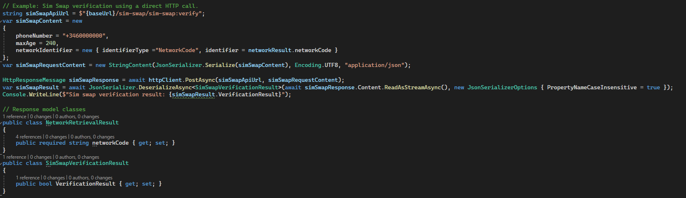

(OPTIONAL) If you wish to test more APC APIs using this method, find in the annex additional REST calls with implementation details using the HttpClient approach:

- [Location REST APC call using .NET HttpClient]()
- [Number Verification  REST APC call using .NET HttpClient]()


## Part 2: Advanced Use Case - Integrating APC into a Banking App

In this section, we explore how Azure Programmable Connectivity (APC) can be integrated into an example banking application, leveraging network APIs to enhance security and user experience. The sample application is detailed in this [README file](/Demo-App/README.md) located in the repository.

### Contents

- [Application  Architecture](#applicaction-architecture)
- [Exercise: Deploying and Testing a Demo Banking Application](#exercise-deploying-and-testing-a-demo-application)
- [Advanced Integration Details](#hands-on-application-code-highlighs)
  - [React Service Calling APC](#make-apc-requests-from-an-app-apc-request-flow)
  - [APC Proxy SDK Usage](#apc-proxy-sdk-usage)
  - [Handling Consent Permission for Location Number Verification](#handling-consent-permission-for-location-number-verification)
  - [Handling Redirections for Number Verification](#handling-redirections-for-number-verification)

### Applicaction Architecture

This section provides a brief technical description of the demo application's architecture. The application is designed to interact with APC for enhanced anti-fraud security measures such as SIM swap detection, number verification and user location verification.

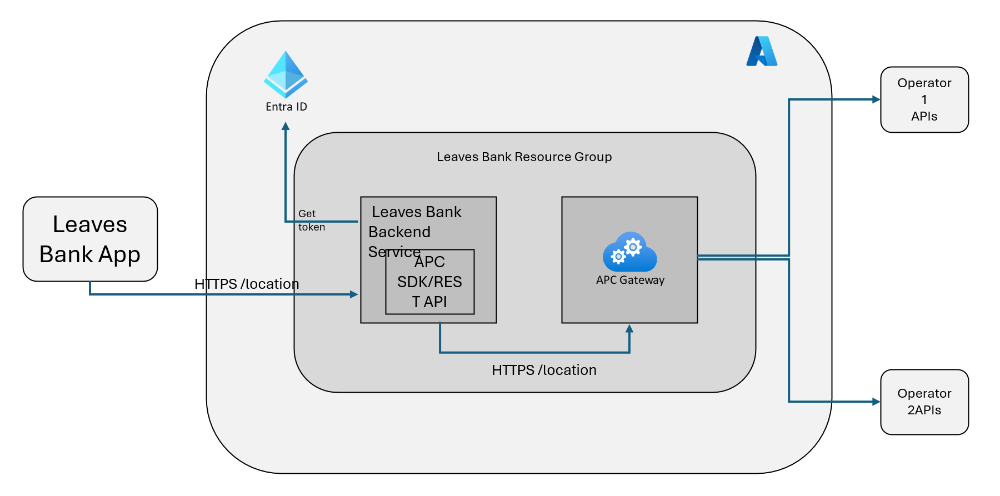

#### Components

- **Leaves Bank App**
  - **Technology**: Built using React Native and Expo Go. Runs on client devices (smartphones).
  - **Features**: Interaction demo with the APCProxyServer for APC interactions.
  - **Repository path**: *src/APC.MobileApp/ReactNative*

- **Leaves Bank Backend Service**
  - **Technology**: .NET8 Web API hosted in an Azure App Service.
  - **Features**: Acts as an intermediary between the React Native app and the APC API and could host additional app logic.
  - **Repository path**: *src/APC.Proxy.API*

- **APC Gateway**
  - **Technology**: Azure service
  - **Features**:  interfaces with mobile network operator APIs.

### Exercise: Deploying and Testing a Demo Application

The practical exercise consists of deploying and testing the "Leaves Banking application", a demo application that leverages APC Network APIs to enhance anti-fraud prevention.

#### Prerequisites

This exercise assumes you completed at least the following sections from part 1:

- [Create APC Gateway Instance](#create-apc-gateway-instance)
- [Set up Authentication](#set-up-authentication)

And will require

- **Cellular Network Connection**: Ensure that your development environment is connected to a supported cellular network. This could be via a mobile hotspot connection from a mobile device or through a 4G/5G router equipped with a SIM card. [Read more about supported cellular connections for these exercises](#network-limitations)
- A smartphone running Android or iOS
 
#### Setup Instructions

Follow the steps in the [demo application README](/Demo-App/README.md) to set up:

- **APC Proxy running in an Azure Web App**
- **Leaves Bank mobile app running on your phone using Expo Go**

Then, follow the usage instructions intended to complement the advanced technical implementations or caveats related to applications using Azure Programmable Connectivity (APC).

### Hands-On: Application code highlighs
This section will guide you through the key parts of the application code, explaining the flow of APC requests, network limitations, and the process of APC number verification.

#### Make APC Requests from an app: APC Request Flow

The APC request flow is a critical component of the application. Understanding this flow will help you grasp how the application interacts with the APC Gateway securely. Here’s an example of how this is implemented:

This diagram shows the request flow from the app to the backend and then to the APC Gateway:


Direct APC calls from the frontend are not advisable due to the sensitive nature of the credentials involved (client ID and secret). Exposing these details can lead to unauthorized access and misuse of Azure resources, as browser tools allow easy access to frontend code. Instead, APC calls are delegated to the backend service, the APC Proxy, which securely handles authentication and integration.


1. **The client app makes a request with the required Network API payload to the backend service.** [Link to js service](../../APC.MobileApp//ReactNative/app/Services/APCService.ts):

    ```ts
    // apcClient is an autogenerated axios client that points to the backend service
    export const checkSimChange = async (apiClient: APCApi, phoneNumber: string) => {
        const networkCode = await getNetworkCode(apiClient);
        const response = await apiClient.apiAPCSimSwapSimSwapverifyPost({
            phoneNumber:  '+' + phoneNumber,
            maxAgeHours: 240,
            networkIdentifier: {
                identifierType: 'NetworkCode',
                identifier: networkCode
            }
        })

        return response.data.verificationResult;
    }
    ```

2. **The backend service processes the call and makes an authenticated request to the APC Gateway using the SDK or a custom REST HTTP client** [Optional: (More on the multiple implementations)](../leaves-implementation-details.md#dependency-injection-for-apc-sdk-http-client-and-mockservice).

Example using the APC SDK [Link to SDK client](../../APC.Proxy.API/APC.Client/APCSdkClient.cs):

    ```csharp
    public async Task<HttpResponseMessage> SimSwapRetrieveAsync(DataModel.SimSwapRetrievalContent request)
    {
        var content = new SimSwapRetrievalContent(new(request.NetworkIdentifier.IdentifierType, request.NetworkIdentifier.Identifier));

        var simSwapClient = _apcClient.GetSimSwapClient();
        var response = await simSwapClient.RetrieveAsync(_apcGatewayId, content);
        return await CreateHttpResponseMessageAsync(response);
    }
    ```

Example using the REST Http client instead [Link to REST Http Client](../../APC.Proxy.API/APC.Client/APCClientDI.cs):

    ```csharp
    // Configure httpClient with APC API settings
    _httpClient.BaseAddress = new Uri(settings.Value.BaseUri);
    _httpClient.DefaultRequestHeaders.Add("apc-gateway-id", _settings.GatewayId);

    ...

    public async Task<HttpResponseMessage> CallApcApiAsync(HttpMethod httpMethod, string endpoint, object? requestContent = null)
    {
        var accessToken = await GetAccessTokenAsync();
        var request = new HttpRequestMessage(httpMethod, endpoint)
        {
            Content = requestContent != null ? JsonContent.Create(requestContent) : null
        };

        request.Headers.Authorization = new AuthenticationHeaderValue("Bearer", accessToken);
        request.Headers.Add("x-ms-client-request-id", Guid.NewGuid().ToString());

        var response = await _httpClient.SendAsync(request);

        return response;
    }
    ```

3. **The APC Gateway respone is returned to the client application**

#### Network Limitations
Using applications with Azure Programmable Connectivity (APC) requires understanding some network connectivity nuances. To use the Network APIs with APC, you need identification from the device making the request. Operators assign external IPs to the cellular network-connected device, as well as a phone number. To identify a device, it's possible to use the currently assigned IPv4/IPv6 address (using the cellular network) or the SIM phone number.

This application is intended to run on phones using cellular networks (4G, 5G) from the users' SIM cards from supported telecom operators. The app uses Network APIs to perform anti-fraud verifications based on this network information. APC requests include device identification information to map and authenticate the request against the right operator.

For this reason, there are some considerations within the app implementation:

- **The app must use the cellular connection:** In a normal use case, the phone should avoid using the WiFi connection. This is why when opening the app it will display a warning message if your wifi connection is active when opening the applicatiom.
  - In this demo app, the client application checks for WiFi connectivity using the Expo API. On some other implementations, apps should use cellular connectivity for these APC requests instead of WiFi.

- **The backend must retrieve the caller IPs:** This ensures that no one is impersonating the user.
  - In this demo app, the APC Proxy backend gathers network info using the IP from frontend requests and uses this IP as the identifier for further APC requests. This ensures that the requests to the APC Gateway are authenticated and authorized based on the originating network's IP.
  
      ```csharp
      [ApiController]
      [Route("[controller]")]
      public class NetworkInfoController : ControllerBase
      {
          [HttpGet]
          public IActionResult GetNetworkInfo()
          {
              // Retrieve the remote IP address and port from the HttpContext
              var remoteIpAddress = Request.HttpContext.Connection.RemoteIpAddress?.ToString();
              var remotePort = Request.HttpContext.Connection.RemotePort;

              // Check if the IP address is not available
              if (string.IsNullOrEmpty(remoteIpAddress))
              {
                  return NotFound("Remote IP address not found.");
              }

              // Return the remote IP address and port
              return Ok($"Remote IP address: {remoteIpAddress}, Remote port: {remotePort}");
          }
      }
      ```

- Some network API calls need to happen using the actual device network: For example, number verification requires the use of the device's actual network.

##### Initial steps
1. **Disable WiFi access for your device**
- **Open the application:** Use the QR as described in the [Leaves Bank app documentation](../leaves-deployment.md).
- If your wifi connection is active when opening the applicatiom, it will display a warning message. Using WiFi is still permited since it could be that the device is connected to netwok hotspot from a phone or 4G/5G router sharing its cellular connection, which is valid for these HOL exercises.

2. **Click Get Started:** During the first steps, the application will make a **device-network request** to the backend, where the backend captures the caller IP.

    

Additionally, operations like number verification follow a specific process that requires these requests to come from the same network as the phone number being checked. Making requests from IP addresses outside the intended network will result in unathorized results in APC hence **the client application must use the cellular network instead of an available WiFI** connection from a non cellular network.

#### Number Verification Process Overview

To demonstrate the functionality of the Number Verification API, follow these steps in the demo app:

1. Input the phone number for the cellular network you are using.
    - This could be either phone number for the sim card used in your device or if you are connecting to a hotspot network for this exercise, the phone number for the hotspot device. More information in [network limitations](#network-limitations).

    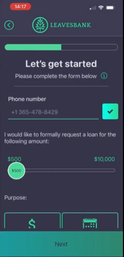

2. Press the checkmark icon to verify the phone number

    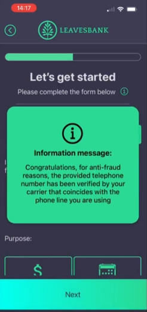

One of the main challenges in implementing number verification is that it requires part of the user flow to be performed from the client app, not just the backend. This is necessary because [Number Verification Network API request](#number-verification) follows an OAuth authentication flow, which involves multiple steps and interactions between the client app, the backend, the APC service and the Operator auth servers.

Here's an overview of the number verification process:

1. User Initiates Verification: The user initiates the number verification process **from the client app to the number verification endpoint in the backend**.

2. Redirect to APC: The **backend service makes a request to the APC Gateway**, including a redirect URI in the body to a callback endpoint in the backend.

3. Redirect to OAuth Authorization Server: **APC redirects the request to the operator authorization server** with the appropriate client ID and redirect URI for authorization.

4. Authorization Server Response: The OAuth authorization server processes the request and **returns to the client app a 302 redirect response towards the backend service** with an authorization code.

5. Exchange Authorization Code: **the backend service makes a request to the APC Gateway with the auth code** and APC exchanges the received authorization code with the operator auth services and if succeeded the verification response.

6. Return Verification Result: APC returns the verification result to the **backend service**, which then communicates the **result back to the client**.

The diagram below illustrates the detailed flow of the number verification process:
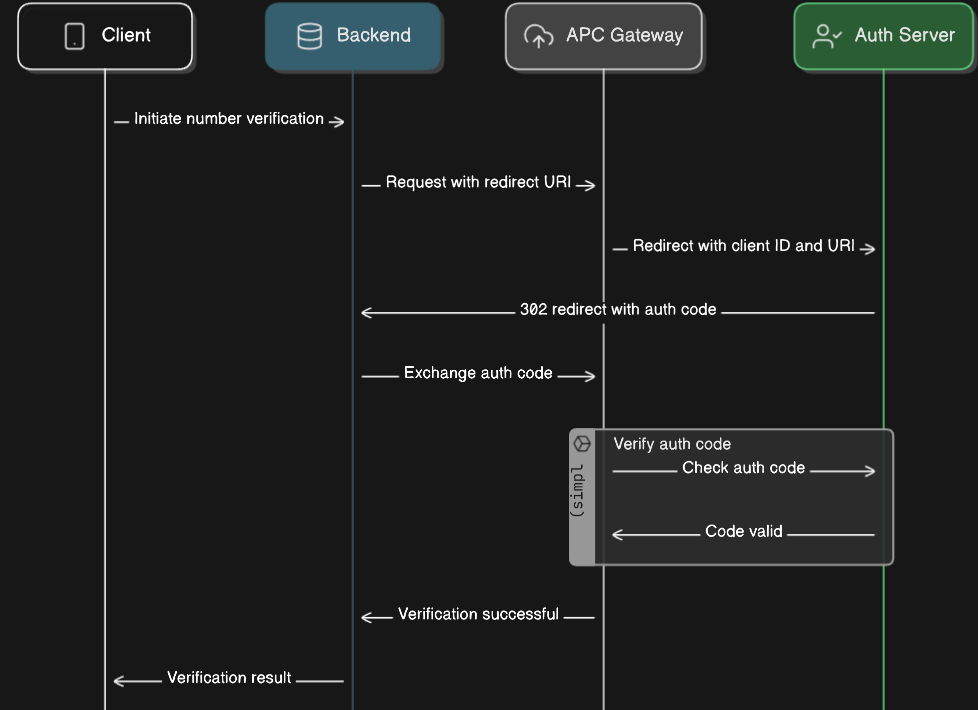

##### Initial Request from Client App to Backend Service:
1. **Client App (Leaves Bank App)** sends a request to initiate number verification using standard HTTP request libraries like Axios. This phase is crucial as it sets the foundation for the authentication process that follows. Note that this request doesn't require special handling; it is a typical HTTP request initiated by the client.
2. **Leaves Bank Backend Service** prepares to request an authentication code from the APC gateway.

##### Backend Service Requests APC Gateway:
After receiving the initial request, the Leaves Bank Backend Service prepares to interact with the APC gateway. 

3. **APC Gateway Call**: The backend makes a POST request to APC Gateway, the response will have Status HTTP 302 but the redirections must be followed by the frontend, as these requests must come from the cellular network the client app is using.

4. **302 Redirect Response**: APC responds with a 302 redirect containing a URL for client app interaction.

##### Manually handling redirections in the backend:
To ensure proper handling of the HTTP 302 responses from the APC gateway, configure the backend's HTTP client to prevent automatic redirection. The frontend has to handle the actual redirections for the authentication flow against the Operator Authentication Services.

To implement this, you can use the .NET HTTP client in the backend to configure the handling of HTTP redirect responses manually. Here's how you can modify the .NET HTTP client to prevent automatic redirection:

5. **Prevent Automatic Redirection in .NET 8 HttpClient**:

    ```csharp
    var handler = new HttpClientHandler { AllowAutoRedirect = false };
    using var httpClient = new HttpClient(handler);
    ```

The client app can follow redirections automatically until it retrieves a response.

##### Backend Service endpoints for Number Verification

The number verification process utilizes two key backend endpoints, as seen in the APCController in the leaves bank backend service [Link to file](../APC.Proxy.API/APC.ProxyServer/Controllers/APCController.cs):

1. **Initial Verification Endpoint**:
   - This endpoint receives the initial request from the frontend, issuing an HTTP 302 response with a location URL.
   - The frontend follows the redirection path outlined earlier, eventually receiving an authentication code from the operator's authentication service.

    ```csharp
    // Endpoint to initiate number verification
    [HttpPost("number-verification/number:verify")]
    public async Task<IActionResult> NumberVerificationVerify([FromBody] NumberVerificationWithoutCodeContent request)
    {
        _logger.LogInformation($"Request model: {JsonSerializer.Serialize(request)}");

        return await HandleRequest(
            () => _apcClient.NumberVerificationVerifyAsync(request),
            "Error occurred while verifying phone number.");
    }
    ```

2. **Callback Endpoint**:
   - This endpoint handles the reception of the authentication code sent back by the frontend.
   - The frontend client will call this endpoint when following the last HTTP 302 redirection. As this endpoint uri was provided in the initial number verification call in the `returnUrl` value/

    ```csharp
    // Callback endpoint to finalize verification
    [HttpGet("number-verification/apcauthcallback")]
    public async Task<IActionResult> NumberVerificationRetrieve(string apcCode)
    {
        return await HandleRequest(
            () => _apcClient.NumberVerificationCallbackVerifyAsync(new NumberVerificationWithCodeContent() { ApcCode = apcCode }),
            "Error occurred while retrieving phone number.");
    }
    ```

#### Location Verification Process Overview

To demonstrate the functionality of the Location Verification API and its ability to detect manipulated GPS data, follow these steps in the demo app:

1. **Navigate to the Residence Location section of the app**: In the number verification screen, select a loan amount and purpose then click next.
2. **Enter some distant residence location**: Input a distant residence location, such a different country or state to your current location.

    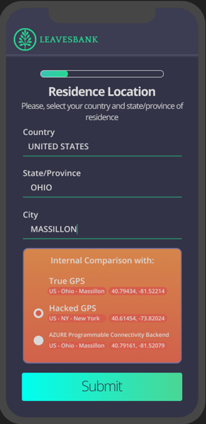

2. **Submit tampered Location Data**:
   - Choose to report "Hacked GPS" coordinates. These should match the residence location you provided.
   - Check the "Use Azure Programmable Connectivity backend"
   - Click 'Submit' to process the coordinates through the API.

3. **View Results**:
   - The app verifies the provided location against the actual device's location as its connected via the operator's network to a radio unit in known coordinates.
   - If the data does not match, as in the case of hacked GPS inputs, an error message is displayed (see Screen 2 below).

    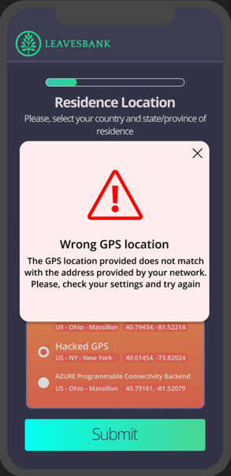

4. **Skip APC verification to tamper with location data**:
   - Uncheck the "Use Azure Programmable Connectivity backend" and click Next again with the "Hacked GPS" coordinates. The app will display a warning message letting the user know that APC location check is disabled.


##### Explanation of Screens
This feature tests the API’s effectiveness in identifying discrepancies between reported locations and those registered by the cellular network, critical for preventing location-based fraud.

- **Screen 1**: Users input their residence location, which is verified against the actual location derived from the cellular network. This ensures the user is actually within the geographical area they claim.
- **Screen 2**: Displays an error if the manipulated (hacked) location data is detected, highlighting the API's capability to prevent fraud by ensuring location accuracy.

Besides disabling APC to proceed, you can input your current location as residence location, and try again with either option.

##### Handling Consent Permission for Location Verification

Network APIs that access device location information such as [Device Location Verification](#device-location-verification) must manage user consent permissions to comply with privacy regulations and operator terms. 

##### Implementation Guide
Applications using such APIs must be prepared to handle consent errors by:

1. **Detecting Consent Errors**: Identifying errors related to consent in the API responses.
2. **Guiding User Action**: Informing the user of the need to grant permissions and providing a method to do so by redirecting to the operator permissions page.

Example of an API response with a consent error:

```json
{
    "error": {
        "message": "Authorization failed due to lack of consent",
        "code": "CONSENT_URL_ERROR",
        "consent_url": "https://open-gate-consents.com.mytelco.io/?jwt=eyJjdH..."
    }
}
```

The application should display the error message and guide the user to the consent URL provided.

##### Current Application Handling
In this application, consent errors are captured but not managed actively. We had to use Postman or an HTTP client to manually fetch the errors and access the consent URLs to overcome these issues in the demo. If you encounter similar errors during the hands-on lab exercise, you can use the same method with Postman to handle them. Here are simple steps to follow:

1. **Open Postman**: Start by launching Postman on your device.
2. **Call the LocationVerify Endpoint**: Use Postman to make a request to the `LocationVerify` endpoint using the cellular connection of a SIM card for which consent has not yet been granted.
3. **Open the Consent URL**: Using the same cellular network, open the consent URL you received in the error message.
4. **Accept the Permissions**: Follow the instructions on the webpage to grant the necessary permissions.


## Annex

### Contents

---
- [Annex](#annex)
  - [Network APIs](#network-apis)
    - [Device Network Retrieval](#device-network-retrieval)
    - [SIM Swap Detection](#sim-swap-detection)
    - [Number Verification](#number-verification)
    - [Device Location Verification](#device-location-verification) 
  - [Additional APC SDK requests using .NET SDK](#additional-apc-sdk-examples-using-net-sdk)
    - [Location APC SDK request](#apc-sdk-device-location)
    - [Number Verification APC SDK request](#apc-sdk-number-verification)
  - [Additional REST APC requests using .NET HttpClient](#additional-apc-rest-http-examples-using-net-httpclient)
    - [Location APC REST .NET HttpClient request](#httpclient-apc-verify-device-location)
    - [Number Verification APC REST HttpClient request](#httpclient-apc-number-verification)
  - [Additional REST APC requests using Postman](#additional-apc-rest-http-examples-using-postman)
    - [Number Verification APC REST Postman request](#postman-apc-number-verification-request)

### Network APIs

This section provides comprehensive details necessary for developers to understand and implement each API effectively. For the most current information and updates, refer to the [Azure Programmable Connectivity documentation.](https://learn.microsoft.com/en-us/azure/programmable-connectivity/azure-programmable-connectivity-network-apis)


####  Device Network Retrieval
##### Endpoint
```curl
POST /device-network/network:retrieve
```

##### Description
Retrieves the network a given device is connected to, returning the network in a format that can be used for other API calls.

##### Request Properties
- **identifierType**: Type of identifier (e.g., IPv4, NetworkCode).
- **identifier**: The actual identifier, such as an IP address or network code.

##### Response Properties
- **networkCode**: Network code that identifies the operator's network.
##### Example Request

```json
{
  "identifierType": "IPv4",
  "identifier": "173.122.1.1"
}
```
##### Example Response

```json
{
  "networkCode": "example-network-code"
}
```


#### Device Location Verification

##### Description
It provides a reliable way to verify that the device is indeed within the specified radius from the given coordinates. This verification process ensures that the location data cannot be tampered with or falsified. 

Device location verification Network API require managing consent permissions to ensure compliance with privacy regulations and operator terms.

##### How APC Verifies Location

The Device Location Verification API performs a critical function by verifying the authenticity of the location data sent by a mobile device.

1. **Connection and Request Origin**: The API utilizes the cellular network connection to determine the origin of the location verification request. Since the device is connected via 4G/5G to a specific radio unit, the API has access to the exact location of this unit.

2. **Cross-Verification Process**: The API compares the coordinates provided in the request (latitude, longitude, and accuracy) with the actual location of the radio unit. This comparison is based on real-time data from the cellular network, which accurately reflects the location of the connected radio unit.


##### Endpoint

```curl
POST /device-location/location:verify`
```

Verifies whether a device is within a specified location area, defined as an accuracy (radius) around a point specified by longitude and latitude.

##### Consent Error - Operator Permission
- If location data access is denied by the operator, the API will return an HTTP 403 error response with code: `CONSENT_URL_ERROR`. This type of message also contains the `consent_url` property with an url valuable pointing to the operator permission form the user has to accept.
- Error handling should account for permissions being revoked or not granted by the user or operator, ensuring that the application complies with privacy laws and user preferences. 

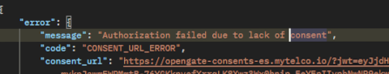

##### Request Properties
- **networkIdentifier**: Network identifier for the query.
- **latitude**: Latitude of the location to verify.
- **longitude**: Longitude of the location to verify.
- **accuracy**: Radius in kilometers within which the location is considered accurate.
- **locationDevice**: The device details used for locating.

##### Response Properties
- **verificationResult**: Boolean indicating whether the device is within the specified area.

##### Example Request

```json
{
  "networkIdentifier": {
    "identifierType": "NetworkCode",
    "identifier": "network-code-here"
  },
  "latitude": 34.0522,
  "longitude": -118.2437,
  "accuracy": 10,
  "locationDevice": {
    "phoneNumber": "+1234567890"
  }
}
```

##### Example Request

```json
{
  "verificationResult": true
}
```

#### Number Verification

##### Description
Verify the authenticity of a mobile number to ensure it is currently active and can receive communications. This verification helps in validating user identity and reducing fraud by authenticating mobile devices seamlessly, thus eliminating the need for SMS one-time passwords and enabling faster and more secure user experiences.

##### OAuth Flow
The number verification process may involve an OAuth flow to ensure that the verification request is authenticated and authorized properly.
Take a look at the detailed explanation in [Number Verification Process Overview](#number-verification-process-overview)

##### Endpoint

```curl 
POST /number-verification/number:verify
```
##### Description
Verifies the phone number associated with a device to confirm its authenticity and current status.

##### Request Properties
- **networkIdentifier:** Network identifier for querying the device.
- **phoneNumber:** Phone number in E.164 format.
##### Response Properties
verificationResult: Boolean indicating if the phone number is verified.
##### Example Request
```json
{
  "networkIdentifier": {
    "identifierType": "NetworkCode",
    "identifier": "network-code-here"
  },
  "phoneNumber": "+1234567890"
}
```
##### Example Response
```json
{
  "verificationResult": true
}
```

#### SimSwap Detection
SimSwap Detection provides verification and retrieval services for SIM swap events associated with a device's phone number.

##### SimSwapVerify
This endpoint verifies if a SIM swap has occurred within a specified period. It returns a boolean indicating whether a SIM swap was detected.

**Endpoint:** `/sim-swap/sim-swap:verify`

**Method:** POST

**Request Parameters:**
- **phoneNumber**: The phone number in E.164 format.
- **maxAgeHours**: Maximum lookback period in hours for verifying SIM swaps.

**Response:**
- **verificationResult**: `true` if a SIM swap has occurred within the specified period, `false` otherwise.

##### SimSwapRetrieve
This endpoint retrieves the timestamp of the most recent SIM swap event for a given phone number.

**Endpoint:** `/sim-swap/sim-swap:retrieve`

**Method:** POST

**Request Parameters:**
- **phoneNumber**: The phone number in E.164 format.
- **networkIdentifier**: Identifier for the network to query for this device.

**Response:**
- **date**: The datetime of the most recent SIM swap.


### Additional APC SDK examples using .NET SDK

##### APC SDK: Device Location

Device location verification can fail if the operator line owner has not given location verification permission for this application. More on this: [Device Location Verification](#device-location-verification)

1. Add code to access the subclient for sim-swap from the base client created earlier `apcClient`:
```csharp
var deviceLocationClient = apcClient.GetDeviceLocationClient();
```
2. Create the location-verify request content using the SDK class `DeviceLocationVerificationContent`. PhoneNumber `phone-number` with your actual number associated with the cellular network you are using:
```csharp
var deviceLocationVerificationContent = new DeviceLocationVerificationContent(new NetworkIdentifier("NetworkCode", "<your-operator-code>"), 80.0, 85.1, 50, new LocationDevice
{
    PhoneNumber = "<phoneNumber>",
});
```
3. Retrieve the device-network response:
```csharp
Response<DeviceLocationVerificationResult> result = deviceLocationClient.Verify(apcGatewayId, deviceLocationVerificationContent);
Console.WriteLine(result.Value.VerificationResult);
```
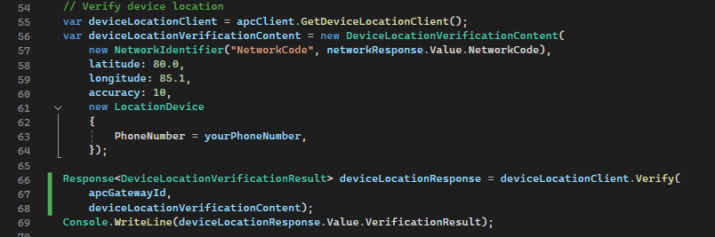

##### APC SDK: Number verification

Number verification involves 2 steps. In the first request, you receive a HTTP 302 redirect response with a location header that must be followed in order to get the `apcCode` which is later used in the second request.

1. **Create a HttpClient that doesn't automatically follow redirects** Create a `HttpClientHandler` with `AllowAutoRedirect` property set to false

    ```csharp
    // Number verification
    var handler = new HttpClientHandler
    {
        AllowAutoRedirect = false
    };
    ```
2. Add the handler as a parameter in the httpClient constructor call.

    ```csharp
    using var httpClient = new HttpClient(handler);
    ```
1. **First APC Request:** Add code to access the subclient for sim-swap from the base client created earlier `apcClient`:
    ```csharp
    NumberVerification numberVerificationClient = apcClient.GetNumberVerificationClient();
    ```
2. Create the number verification request content using the SDK class `NumberVerificationWithoutCodeContent`. PhoneNumber `phone-number` with your actual number associated with the cellular network you are using:
    ```csharp
    NumberVerificationWithoutCodeContent numberVerificationWithoutCodeContent = new NumberVerificationWithoutCodeContent(
        new NetworkIdentifier("NetworkCode", "<your-operator-code>"),
        new Uri("http://your-redirect-url.com")){ PhoneNumber = "<phoneNumber>", };

    ```
3. Retrieve the response and extract the `Location` header value:
    ```csharp
    var response = await numberVerificationClient.VerifyWithoutCodeAsync(apcGatewayId, numberVerificationWithoutCodeContent);

    var locationUrl = response.GetRawResponse().Headers.TryGetValue("location", out var location) ? location : "not found";

    Console.WriteLine($"location redirect URL: {locationUrl}");
    ```

5. Make a new HTTP GET to the url value from the `Location` header on the previous response. Send the GET request and copy the next `Location` header value from the new 302 response.
    ```csharp
    // Following redirects manually
    string firstRedirectUri = initialNumberVerificationResponse.Headers.Location?.ToString();
    HttpResponseMessage firstRedirectResponse = await httpClient.GetAsync(firstRedirectUri);
    ```

6. Add the three remaining manual redirects.
    ```csharp
    var secondRedirectUri = firstRedirectResponse.Headers.Location?.ToString();
    HttpResponseMessage secondRedirectResponse = await httpClient.GetAsync(secondRedirectUri);

    var thirdRedirectUri = secondRedirectResponse.Headers.Location?.ToString();
    HttpResponseMessage thirdRedirectResponse = await httpClient.GetAsync(thirdRedirectUri);

    var fourthRedirectUri = thirdRedirectResponse.Headers.Location?.ToString();
    HttpResponseMessage fourthRedirectResponse = await httpClient.GetAsync(fourthRedirectUri);
    ```
    
7. Extract the authentication code the `Location` header value for the fourth redirect. It should contain the `redirectUri` you specified plus an `apcCode` parameter.
    ```csharp
    // Retrieve APC Code
    var finalRedirectUri = fourthRedirectResponse.Headers.Location?.ToString();
    var uri = new Uri(finalRedirectUri);
    var query = System.Web.HttpUtility.ParseQueryString(uri.Query);
    var apcCode = query["apcCode"];
    Console.WriteLine($"Captured APC Code: {apcCode}"); 
    ```

8. **Second APC Request:** remaining manual redirects.
    ```csharp
    var secondRedirectUri = firstRedirectResponse.Headers.Location?.ToString();
    HttpResponseMessage secondRedirectResponse = await httpClient.GetAsync(secondRedirectUri);

    var thirdRedirectUri = secondRedirectResponse.Headers.Location?.ToString();
    HttpResponseMessage thirdRedirectResponse = await httpClient.GetAsync(thirdRedirectUri);

    var fourthRedirectUri = thirdRedirectResponse.Headers.Location?.ToString();
    HttpResponseMessage fourthRedirectResponse = await httpClient.GetAsync(fourthRedirectUri);
    ```
    
7. Extract the authentication code the `Location` header value for the fourth redirect. It should contain the `redirectUri` you specified plus an `apcCode` parameter.
    ```csharp
    // Retrieve APC Code
    var finalRedirectUri = fourthRedirectResponse.Headers.Location?.ToString();
    var uri = new Uri(finalRedirectUri);
    var query = System.Web.HttpUtility.ParseQueryString(uri.Query);
    var apcCode = query["apcCode"];
    Console.WriteLine($"Captured APC Code: {apcCode}"); 
    ```

9. Create the number verification request content using the SDK class `NumberVerificationWithCodeContent`. Use the `apcCode` retrieved:
    ```csharp
    NumberVerificationWithCodeContent numberVerificationWithCodeContent = new NumberVerificationWithCodeContent(apcCode);
    ```
3. Retrieve the verification result with the code `NumberVerificationWithCodeContent`. Use the `apcCode` retrieved:
    ```csharp
    Response<NumberVerificationResult> numberVerificationResponse = await numberVerificationClient.VerifyWithCodeAsync(apcGatewayId, numberVerificationWithCodeContent);
    Console.WriteLine(numberVerificationResponse.Value.VerificationResult);
    ```
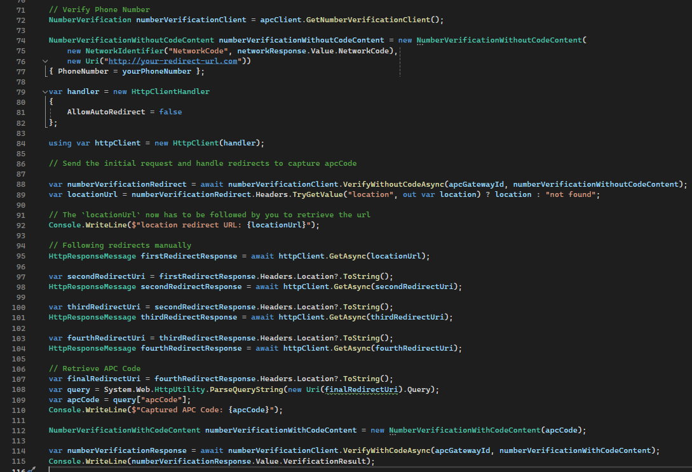

### Additional APC REST HTTP examples using .NET HttpClient

##### HttpClient APC: Verify device location
1. Prepare the device location verify content:
```csharp
string locationApiUrl = $"{baseUrl}/device-location/location:verify";
var locationContent = new
{
    networkIdentifier = new { networkCode = networkResult.networkCode },
    latitude = 40.7128,
    longitude = -74.0060,
    accuracy = 10,
    locationDevice = new { phoneNumber = "your-phone-with-country-code" }
};
var locationRequestContent = new StringContent(JsonSerializer.Serialize(locationContent), Encoding.UTF8, "application/json");
```

2. Retrieve the device location verify response:
```csharp
HttpResponseMessage locationResponse = await httpClient.PostAsync(locationApiUrl, locationRequestContent);
var locationResult = await JsonSerializer.DeserializeAsync<DeviceLocationVerificationResult>(await locationResponse.Content.ReadAsStreamAsync(),
    new JsonSerializerOptions { PropertyNameCaseInsensitive = true });
Console.WriteLine($"Device location verification result: {locationResult.VerificationResult}");
```
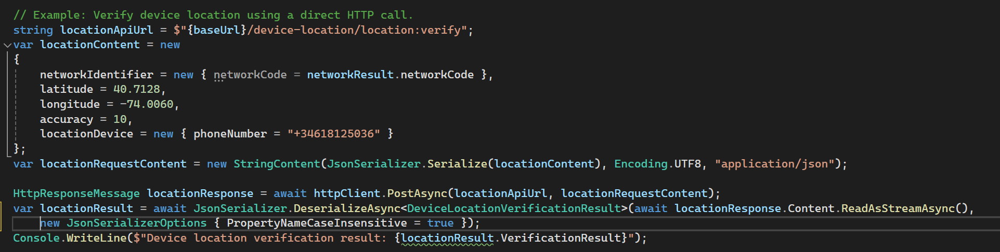

##### HttpClient APC: Number verification

Number verification involves 2 APC requests along with some HTTP 302 redirections that in a normal scenario would befollowed automatically, refer to [Number Verification Process Overview](#number-verification-process-overview) for real-word number verification example. 

**APC Requests for number verification:**

- Retrieve APC auth code flow: you receive some HTTP 302 redirect responses from and to operator authentication servers. For this exercise, these redirect responses are followed manually to retrieve the APC Code.
- Verify the retrieved APC auth code.

1. **Modify or create the HttpClient up to not automatically follow redirects** Create a `HttpClientHandler` with `AllowAutoRedirect` property set to false

    ```csharp
    // Number verification
    var handler = new HttpClientHandler
    {
        AllowAutoRedirect = false
    };
    ```

2. Add the handler as a parameter in the httpClient constructor call.

    ```csharp
    using var httpClient = new HttpClient(handler);
    ```

3. Prepare the number verification apc code retrieval request. The request content property `redirectUri` can be any Uri as it won't be followed in this case, however in real-word scenarios, this should a service of yours capable of making or propagating APC requests. Read more about real-word scenarios in [Number Verification Process Overview](#number-verification-process-overview)

    ```csharp
    // First Number Verification Request
    string numberVerificationInitUrl = $"{baseUrl}/number-verification/number:verify";
    var numberVerificationInitContent = new
    {
        networkIdentifier = new { identifierType = "NetworkCode", identifier = networkResult.networkCode },
        phoneNumber = "+3460000006",
        redirectUri = "https://localhost:7127/api/APC/number-verification/apcauthcallback"
    };
    var initRequestContent = new StringContent(JsonSerializer.Serialize(numberVerificationInitContent), Encoding.UTF8, "application/json");
    ```

4. **First APC Request:** Make the HTTP Request. The result should be a HTTP `302` response with a Location header containing the next call in the number verification flow. This location won't be followed automatically since we configured the HttpClient when instanciating it.

    ```csharp
    // Send the initial request and handle redirects to capture apcCode
    HttpResponseMessage initialNumberVerificationResponse = await httpClient.PostAsync(numberVerificationInitUrl, initRequestContent);
    ```

5. Make a new HTTP GET to the url value from the `Location` header on the previous response. Send the GET request and copy the next `Location` header value from the new 302 response.
    ```csharp
    // Following redirects manually
    string firstRedirectUri = initialNumberVerificationResponse.Headers.Location?.ToString();
    HttpResponseMessage firstRedirectResponse = await httpClient.GetAsync(firstRedirectUri);
    ```

6. Add the three remaining manual redirects.
    ```csharp
    var secondRedirectUri = firstRedirectResponse.Headers.Location?.ToString();
    HttpResponseMessage secondRedirectResponse = await httpClient.GetAsync(secondRedirectUri);

    var thirdRedirectUri = secondRedirectResponse.Headers.Location?.ToString();
    HttpResponseMessage thirdRedirectResponse = await httpClient.GetAsync(thirdRedirectUri);

    var fourthRedirectUri = thirdRedirectResponse.Headers.Location?.ToString();
    HttpResponseMessage fourthRedirectResponse = await httpClient.GetAsync(fourthRedirectUri);
    ```
    
7. Extract the authentication code the `Location` header value for the fourth redirect. It should contain the `redirectUri` you specified plus an `apcCode` parameter.
    ```csharp
    // Retrieve APC Code
    var finalRedirectUri = fourthRedirectResponse.Headers.Location?.ToString();
    var uri = new Uri(finalRedirectUri);
    var query = System.Web.HttpUtility.ParseQueryString(uri.Query);
    var apcCode = query["apcCode"];
    Console.WriteLine($"Captured APC Code: {apcCode}"); 
    ```

8. **Second APC Request:**Create the number verification request content. Use the `apcCode` retrieved earlier:
    ```csharp
    // Using the apcCode to verify number
    string numberVerificationUrl = $"{baseUrl}/number-verification/number:verify";
    var numberVerificationContent = new
    {
        apcCode = apcCode
    };
    var verifyRequestContent = new StringContent(JsonSerializer.Serialize(numberVerificationContent), Encoding.UTF8, "application/json");
    ```
9. Retrieve the verification result:
    ```csharp
    HttpResponseMessage verificationResponse = await httpClient.PostAsync(numberVerificationUrl, verifyRequestContent);
    var verificationResult = await JsonSerializer.DeserializeAsync<dynamic>(await verificationResponse.Content.ReadAsStreamAsync(), new JsonSerializerOptions { PropertyNameCaseInsensitive = true });

    Console.WriteLine($"Number verification result: {verificationResult}");
    ```


### Additional APC REST HTTP examples using Postman

##### Postman APC Number Verification Request

1. Navigate to `number-verification > number:verify` request
2. Adjust the request payload in the `Body` tab with your data.
  ```json
  {
    "networkIdentifier": {
      "identifierType": "NetworkCode",
      "identifier": "your-network-code"
    },
    "phoneNumber": "your-phone-inc-countrycode",
    "redirectUri": "your-service-auth-callback"
  }
  ```


3. Go to the settings tab and make sure the setting `Automatically follow redirects` is set to OFF. Following this step, you will procceed to manually follow **three** 302 redirect calls. In a normal scenario these would befollowed automatically, refer to [Number Verification Process Overview](#number-verification-process-overview) for real-word number verification example. 

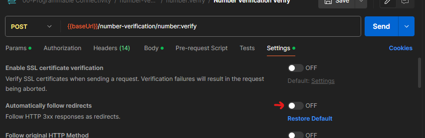

4. Click Send and once it completes the result should be a HTTP `302` response with a Location header containing the next call in the number verification flow. Copy the url value for the `Location` header. 


5. **1/3 302 request**: Create a new request in a new tab and paste the url value from the step before. Make sure the `Automatically follow redirects` setting is OFF. Send the GET request and copy the next `Location` header value from the new 302 response.


5. **2/3 302 request**: Create a new request in a new tab and paste the url value from the step before. Make sure the `Automatically follow redirects` setting is OFF. Send the GET request and copy the next `Location` header value from the new 302 response.

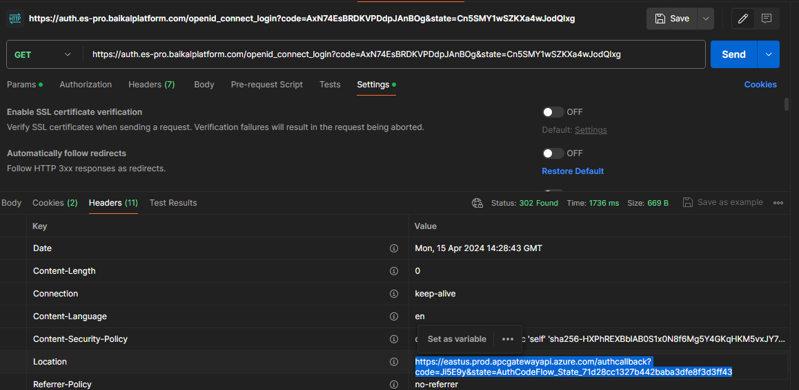

5. **3/3 302 request**: Create a new request in a new tab and paste the url value from the step before. Make sure the `Automatically follow redirects` setting is OFF. Send the GET request and copy the query param named `apcCode` in the `Location` header value from the new 302 response.

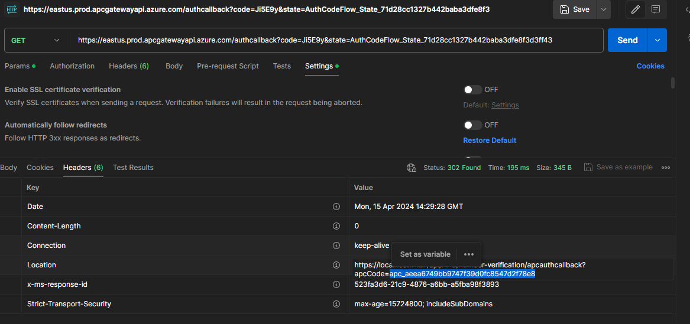

6. Go back to and modify the original `number-verification > number:verify` request's payload with the following content, then click Send to retrieve the number verification result.

```json
{
    "apcCode": "your-apc-code-retrieved-in-step-5"
}
```


