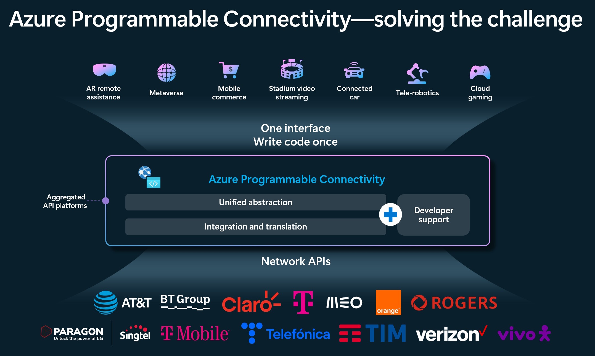
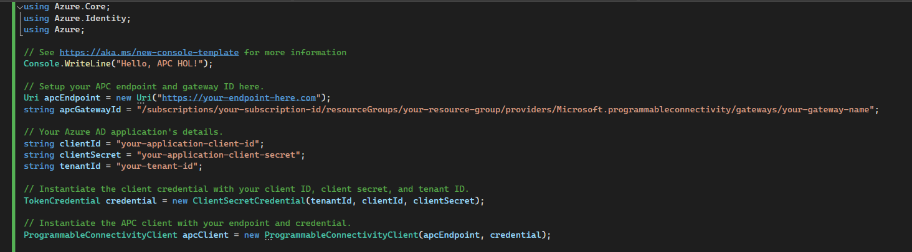

# Azure Programmable Connectivity (APC) Hands-On Lab

Welcome to the Azure Programmable Connectivity Hands-On Lab. In this lab, we will explore the powerful features of APC that enable developers to integrate telecom operator services directly into their applications. This lab is designed to give you practical experience with APC, taking you from the basics of setup and testing to advanced integration scenarios.

### Suggested Timeline
| Time    | Activity |
| ------- | -------- |
| 10 min  | [Introduction to Azure Programmable Connectivity (APC)](#introduction-to-azure-programmable-connectivity-apc) |
| 30 min  | Part 1: [Getting Started with APC](#part-1-getting-started-with-apc)   |
|         | [Using APC SDK](#using-apc-sdk) |
| 1 h     | [Advanced Implementation and Integration of APC](./004-part2-advanced-apc.md) |
|         | Part 2 [Deploy and Test the demo app](./005-part2-exercise-demo-bank-app.md) |
| 30 min  | Annex   |
|         | [HTTP Client](./006-annex-http.md) |
|         | [Postman](./006-annex-postman.md) |


Part 1 of this lab is designed to give you a swift yet comprehensive introduction to APC, equipping you with the knowledge to deploy an APC Gateway and make initial API calls. It's ideal for learners who are new to APC or require a quick start guide for incorporating APC into their applications.

Part 2 is designed for a deeper dive into APC's real-world applications. It's ideal for those looking to understand the intricacies of integrating APC within a backend system and leveraging its full potential in complex projects. This section is recommended for anyone interested in the technical implementation of APC.

### Complete index

- [Introduction](#introduction-to-azure-programmable-connectivity-apc)
  - [Overview of APC](#overview-of-apc)
  - [Architecture](#architecture)
  - [Scenarios and Use Cases](#additional-information)
- [Part 1: Getting Started with APC](#part-1-get-started-with-apc)
  - [Prerequisites](#prerequisites)
  - [Create APC Gateway instancce in Azure](#create-apc-gateway-instance)
  - [Authentication Configuration](#set-up-authentication)
- [Using APC SDK](#use-apc-with-the-net-sdk)
  - [Project Creation and Setup](./002-part1-using-apc-sdk.md#project-creation-and-setup)
  - [APC SDK Calls](./002-part1-using-apc-sdk.md#apc-sdk-calls)
- [Testing with Postman](./003-part1-apc-http-calls.md#testing-with-postman)
- [Part 2: Advanced Implementation and Integration of APC](./004-part2-advanced-apc.md)
  - [System Architecture and Integration Details](./004-part2-advanced-apc.md#system-architecture-and-integration-details)
- [Exercise: Deploying and Testing a Demo Banking Application](./005-part2-exercise-demo-bank-app.md)
  - [Deployment Steps and Testing Scenarios](./005-part2-exercise-demo-bank-app.md#deployment-steps-and-testing-scenarios)

---

## Introduction to Azure Programmable Connectivity (APC)

### Overview of APC

Azure Programmable Connectivity (APC) is a transformative Azure service connecting cloud applications to mobile operator networks. , fostering innovation across various sectors.

Azure Programmable Connectivity (APC) serves as a bridge between application services and telecom operator APIs, offering a streamlined method to access an array of operator network services. It simplifies the use of telecommunications capabilities like SIM swap detection and location-based services through easy-to-implement APIs



### Architecture

 Here’s a high-level view of the typical architecture:

- Application Clients: These can range from Single Page Applications (SPAs) to mobile apps or any other client-side applications. They are the consumer-facing end of the system, interacting with the application service to perform various tasks like SIM swap checks or retrieving location data.

- Application Service: This is the backend that your application clients communicate with. It is responsible for processing client requests, handling business logic, and making authenticated calls to the APC Gateway. This service can be hosted on cloud platforms like Azure or on-premises.

- APC Gateway: Hosted on Azure, the APC Gateway is an intermediary that securely connects to multiple operator networks. It translates the requests from the application service into the specific protocols, authentication and data formats that telecom operators require.

- Operator Network APIs: These are the services and APIs provided by telecom operators, which offer functionality such as number verification, SIM swap detection, and user location services. APC abstracts the complexities of these operator-specific APIs, presenting a unified and standardized interface for the application service to interact with.

Here is an overview diagram depicting the interaction between these components:


### APC Planned Operator APIs

APC enables direct access to a range of operator APIs, designed to streamline complex telecom functionalities into developer-friendly services. Below is a table summarizing the planned operator APIs:

| API                 | Description                                                                                   |
|---------------------|-----------------------------------------------------------------------------------------------|
| SIM Swap Detection  | Allows detection of SIM card changes, crucial for fraud prevention in security-sensitive operations. |
| Number Verification | Verifies the authenticity of mobile numbers, enhancing trust and reducing spam.                |
| Location Services   | Provides network-based location data, ideal for location-sensitive applications.              |
| Quality of Service (QoS) | Ensures prioritized network traffic for essential services, maintaining performance standards. |
| Billing and Charging | Facilitates direct carrier billing capabilities, enabling seamless transactions.              |

Each API offers a unique set of functionalities, aligning with modern application needs and user expectations, propelling APC to the forefront of cloud-telecom integrations.

### Additional information

For a deeper understanding of Azure Programmable Connectivity (APC), including its potential impact and further details on its capabilities, refer to the following resources:

- [Azure Programmable Connectivity blogpost: Empowering the Next Generation of Connectivity Services](https://techcommunity.microsoft.com/t5/azure-for-operators-blog/azure-programmable-connectivity-empowering-the-next-generation/ba-p/4063967)

- [Azure Programmable Connectivity Overview](https://learn.microsoft.com/en-us/azure/programmable-connectivity/azure-programmable-connectivity-overview)

- [Azure Programmable Connectivity Product Page](https://azure.microsoft.com/en-us/products/programmable-connectivity/)


## Part 1: Get Started with APC

- [Set up](./001-part1-set-up.md)
  - [Prerequisites](./001-part1-set-up.md#prerequisites)
  - [Create APC Gateway Instance](./001-part1-set-up.md#deployment-of-apc-in-azure)
  - [Authentication Configuration](./001-part1-set-up.md#authentication-configuration)
- [Using APC SDK](./002-part1-using-apc-sdk.md)
  - [Project Creation and Setup](./002-part1-using-apc-sdk.md#project-creation-and-setup)
  - [APC SDK Calls](./002-part1-using-apc-sdk.md#apc-sdk-calls)
- [Use with Postman](./003-part1-apc-http-calls.md#testing-with-postman)

### Prerequisites

Before starting your journey with Azure Programmable Connectivity (APC), make sure you have the following prerequisites ready:

- **Azure Subscription**: Access to an Azure subscription is necessary to deploy APC resources. If you don't have one, you can create a [free account](https://azure.microsoft.com/free/).

- **Azure CLI and PowerShell**: Familiarity with Azure CLI or PowerShell is essential for deploying resources and automation scripting.

- **Development Environment**: Set up your preferred IDE or code editor, such as Visual Studio Code or Visual Studio, configured for console app development.

### Create APC Gateway Instance


* Follow the [guide](https://learn.microsoft.com/azure/programmable-connectivity/azure-programmable-connectivity-create-gateway) to create a gateway, or have one already.
* Note down your endpoint and `apc-gateway-id`, which is retrieved by following the guide linked.

Deploying an APC Gateway in Azure is a straightforward process that involves the following steps:

1. In the Azure portal, search for **APC Gateways** and then select **Create**.

   

2. Select your **Subscription**, **Resource Group**, and **Region**.

   

3. Provide a unique **Name** for your gateway and proceed to the next steps.

Once your gateway is created, you'll need to configure it:

1. Assign the telecom operator setup, selecting the appropriate APIs and plans.

2. Complete the application details, which will be shared with the operator for validation.

   

3. Agree to the operators' terms and conditions to finalize the setup.

### Set up authentication

To authenticate and access the APC Gateway, create a Microsoft Entra application:

1. Follow the instructions to [register an application with Microsoft Entra ID](https://learn.microsoft.com/en-us/entra/identity-platform/howto-create-service-principal-portal) and create a service principal.

2. Record the application client ID and client secret or certificate for future use.

3. Assign the necessary role to your application using Azure CLI:

```sh
az role assignment create --role 609c0c20-e0a0-4a71-b99f-e7e755ac493d
--scope /subscriptions/$SUB_ID/resourceGroups/$RG_NAME/providers/Microsoft.ProgrammableConnectivity/gateways/$GATEWAY_NAME
--assignee $APP_ID
```

### Create a Console Application

To start using the Azure Programmable Connectivity (APC) SDK, you'll need to create a new console application. This application will serve as the foundation for integrating with APC services.

1. Open your IDE or code editor.
2. Create a new .NET 8 console application project.
3. Name your project appropriately to reflect its purpose, such as `APCIntegration`.

### Install the APC SDK

With your project created, the next step is to install the APC SDK:

1. Use the NuGet Package Manager to search for `Azure.Communication.ProgrammableConnectivity`.
2. Install the latest stable version of the SDK to your project.


or use dotnet CLI to install the NuGet Package from the project folder path:

```dotnetcli
dotnet add package Azure.Communication.ProgrammableConnectivity --prerelease
```

## APC SDK Client

The APC SDK simplifies making API calls by providing strongly typed methods for each APC service. Here's how to get started:

### Instanciate the client

The client library uses [`Azure.Identity`](https://learn.microsoft.com/dotnet/api/azure.identity?view=azure-dotnet) credentials to authenticate with APC. 

1. Install Azure.Identity nugget package.

2. Obtain client credential by implementing this authentication logic in your application using the noted clientId and clientSecret from the authentication section in prerequisites.
```csharp
TokenCredential credential = new ClientSecretCredential(tenantId, clientId, clientSecret);
```
3. Instanciate the SDK client using:
```csharp
ProgrammableConnectivityClient apcClient = new ProgrammableConnectivityClient(apcEndpoint, credential);
```


### Key concepts for APC calls

For each call that you make to APC with the SDK, you will follow the same pattern:
* Create a client `apcClient = new ProgrammableConnectivityClient()`
* Access the sub-client for your use case (sim-swap/location/number-verification/device-network) by calling say `apcClient.GetSimSwapClient()`
* Create the content for your request by using the objects given by the SDK, for example `SimSwapVerificationContent`
* Call the client with the content you've created
* Access the result

### APC Call #1: Retrieve Network Information
To make most of the APC calls, you'll need the network information of the device. Request this information from APC:

1. Access the subclient for the device network from the base client created earlier `apcClient`:
```csharp
var deviceNetworkApcClient = apcClient.GetDeviceNetworkClient();
```
2. Create the device-network request content using the SDK class `Networkidentifier`. Replace `phone-number` with your actual number associated with the cellular network you are using:
```csharp
var networkIdentifier = new NetworkIdentifier("phone-number"); // TODO do IPv4
```
3. Retrieve the device-network response:
```csharp
Response<NetworkRetrievalResult> response = deviceNetworkApcClient.Retrieve(ApcGatewayId, networkIdentifier);
```


### APC Call #2: Sim Swap retrieve/verify

To make the first operator network API call, once you have the client configured and retrieved the network information:

1. Add code to access the subclient for sim-swap from the base client created earlier `apcClient`:
```csharp
var deviceNetworkApcClient = apcClient.GetSimSwapClient()
```
2. Create the sim-swap request content using the SDK class `SimSwapVerificationContent`. PhoneNumber `phone-number` with your actual number associated with the cellular network you are using:
```csharp
SimSwapVerificationContent content = new SimSwapVerificationContent(new NetworkIdentifier("NetworkCode", "Orange_Spain"))
{
    PhoneNumber = "phone-number",
    MaxAgeHours = 120,
};
```
3. Retrieve the device-network response:
```csharp
Response<SimSwapVerificationResult> response = client.Verify(ApcGatewayId, content);
Console.WriteLine($"Verification result: {response.Value.VerificationResult}");
```


# Use Network APIs with APC REST APIs

This section covers how to interact with Azure Programmable Connectivity (APC) using direct HTTP calls. You'll learn to set up Postman for making authenticated requests, and how to construct these requests using .NET HttpClient in a console application.

## A. Make APC requests with Postman (SIM Swap)

### Setup: Configure Postman for Authenticated Requests to APC

To make authenticated requests to the APC API, you need to set up Postman with the correct authorization headers. Here are the steps to configure Postman:

1. Open Postman, click import and drag the collection linked in this repo [Link to APC Postman collection](apc-postman.json)


2. Double click the collection name that appeared on the collection side menu and go to the tab `Authorization`


3. Scroll down to `Configure New Token` section and replace the values for `client id` and `client secret`. TODO add tenantId


4. Click `Ctrl + S` to save and navigate to `sim-swap:verify` request


5. Adjust the request payload in the `Body` tab

Here's an example for the request payload to perform a SIM Swap verify:

**Body**:
  ```json
  {
    "phoneNumber": "+1234567890",
    "networkIdentifier": {
      "identifierType": "NetworkCode",
      "identifier": "network-code-here"
    }
  }
  ```


6. Click `Send` and view the response


## B. Run APC REST APIs with .NET HttpClient

You can also use the .NET HttpClient to make authenticated calls to APC. Here's a basic example of how you can implement this in a .NET 8 console application:

```C#
using System;
using System.Net.Http;
using System.Net.Http.Headers;
using System.Text.Json;
using System.Threading.Tasks;

namespace ApcHttpClientDemo
{
    class Program
    {
        static async Task Main(string[] args)
        {
            var httpClient = new HttpClient();
            var requestUrl = "https://<apc-gateway-url>/sim-swap/check";
            
            var requestContent = new StringContent(
                JsonSerializer.Serialize(new
                {
                    phoneNumber = "+1234567890",
                    networkIdentifier = new { identifierType = "NetworkCode", identifier = "network-code-here" }
                }), System.Text.Encoding.UTF8, "application/json");

            httpClient.DefaultRequestHeaders.Authorization = 
                new AuthenticationHeaderValue("Bearer", "<Your-Access-Token>");

            var response = await httpClient.PostAsync(requestUrl, requestContent);
            var responseContent = await response.Content.ReadAsStringAsync();
            
            Console.WriteLine($"Response Status: {response.StatusCode}");
            Console.WriteLine($"Response Body: {responseContent}");
        }
    }
}
```

Find in the annex additional REST calls with implementation details using the HttpClient approach.

- [Location REST APC call using .NET HttpClient]()
- [Number Verification  REST APC call using .NET HttpClient]()


## Part 2: Advanced Use Case - Integrating APC into a Banking App

In this section, we explore how Azure Programmable Connectivity (APC) can be integrated into a banking application to enhance security and user experience by leveraging network APIs.

The sample application explained is available in this repository [github link](../)

### Components

- **React Native Application**
  - **Environment**: Client devices (smartphones).
  - **Features**: Interaction demo with the APCProxyServer for APC interactions.
  - **Technology**: Built using React Native and Expo Go.

- **APCProxyServer**
  - **Hosting**: Azure App Service API.
  - **Role**: Acts as an intermediary between the React Native app and the APC API.
  - **Responsibilities**: Authentication, request forwarding, and minimal data processing.

- **APC Gateway**
  - **Location**: Cloud.
  - **Functionality**: WIP

WIP Diagram just with Leavesbank app components


### React Service Calling APC

The front-end React service communicates with APC to verify the user's phone number and detect SIM swaps, adding an extra layer of security for transactions.

```javascript
// React service example for calling APC

const callApcForVerification = async (phoneNumber) => {
  const response = await fetch('/apc-verify', {
    method: 'POST',
    headers: {
      'Content-Type': 'application/json',
      'Authorization': `Bearer ${token}`, // Token obtained from authentication
    },
    body: JSON.stringify({ phoneNumber }),
  });
  
  if (!response.ok) {
    throw new Error(`APC verification failed: ${response.statusText}`);
  }

  return await response.json();
};
```
### APC Proxy SDK Usage

Our backend leverages the APC Proxy SDK to make API calls. Since its a demo app there is no extra business logic. This SDK simplifies the code needed to interact with APC by providing direct methods for common operations.


### Dependency Injection for SDK + HttpClient
The backend service is designed with dependency injection (DI) to utilize the APC SDK for handling complex logic and HttpClient for direct REST calls where needed.

### Handling Redirections for Number Verification
For number verification, the banking app redirects users to a consent page if required by the operator. This ensures compliance with privacy regulations and operator terms.


## Get Started (temporal)

This section provides a step-by-step guide to get the project up and running on your local machine and mobile device.

### Prerequisites
Before starting, ensure you have the following installed:
- Git
- Node.js

### Local Setup and Testing

To set up and run the project locally, follow these steps:

1. **Clone the Project**
   ```
   git clone [Repository URL]
   ```

2. **Navigate to the React Native App Directory**
   ```
   cd [Repo path]/APC.MobileApp/ReactNative
   ```

3. **Install Dependencies**
   ```
   npm install
   ```

4. **Start the Application**
   ```
   npm start
   ```

5. **Open in a Web Browser**
   - Once the Metro Bundler is running in your terminal, press `W` to open the app in your web browser. Use responsive mode when opening the developer console with F12.


### Mobile Testing

To test the app on a mobile device, follow these additional steps:

1. **Download Expo Go**
   - Install the Expo Go application from your device's app store (available on iOS and Android).

2. **Scan QR Code**
   - Open the Expo Go app on your mobile device.
   - Select the option to scan the QR code.
   - Scan the QR code that appears in your terminal after you've run `npm start` from the React Native app directory.


This will open the app on your mobile device, allowing you to test its features in a mobile environment.


## Annex

### Additional REST APC calls using .NET HttpClient

#### Location REST APC calls using .NET HttpClient

#### Number Verification REST APC calls using .NET HttpClient

### Additional REST APC calls using Postman

#### Location REST APC calls using Postman

#### Number Verification REST APC calls using Postman
