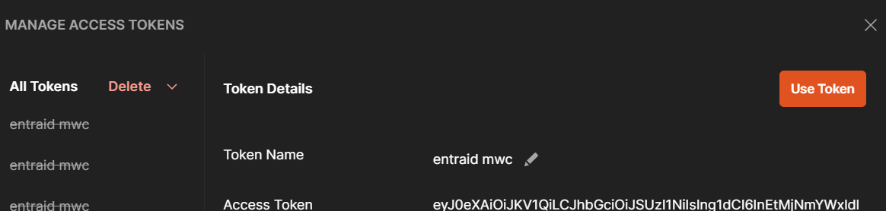
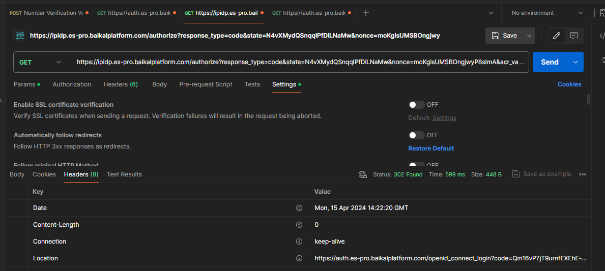
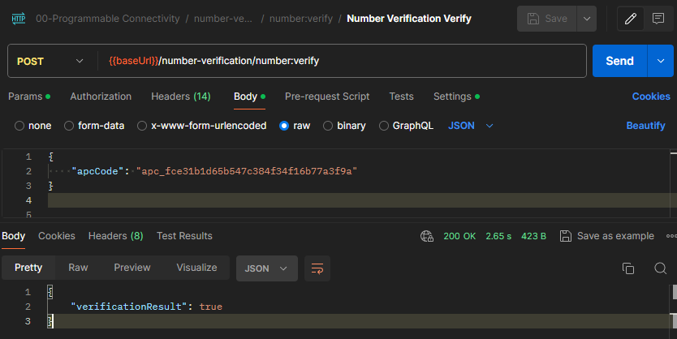

# Azure Programmable Connectivity (APC) Hands-On Lab

Welcome to the Azure Programmable Connectivity Hands-On Lab. In this lab, we will explore the powerful features of APC that enable developers to integrate telecom operator services directly into their applications. This lab is designed to give you practical experience with APC, taking you from the basics of setup and testing to advanced integration scenarios.

### Suggested Timeline
| Time    | Activity |
| ------- | -------- |
| 10 min  | [Introduction to Azure Programmable Connectivity (APC)](#introduction-to-azure-programmable-connectivity-apc) |
| 30 min  | **Part 1:** [Getting Started with APC](#part-1-get-started-with-apc)   |
|         | [Use Network APIs with the APC SDK Client](#use-network-apis-with-the-apc-sdk-client) |
|         | [Use Network APIs with APC REST APIs](#use-network-apis-with-apc-rest-apis) |
|  1 hour   | **Part 2:** [ Advanced Use Case - Integrating APC into a Banking App](#part-2-advanced-use-case---integrating-apc-into-a-banking-app) |
|         |  [Architecture](#architecture) |
|         |  [Advanced Integration Details](#advanced-integration-details) |
|         |  [Exercise: Deploying and Testing a Demo Banking Application](#exercise-deploying-and-testing-a-demo-banking-application) |
| 30 min  | [Annex](#annex) (optional)   |


- **Part 1** of this lab is designed to give you a swift yet comprehensive introduction to APC, equipping you with the knowledge to deploy an APC Gateway and make initial API calls. It's ideal for learners who are new to APC or require a quick start guide for incorporating APC into their applications.

- **Part 2** is designed for a deeper dive into APC's real-world applications. It's ideal for those looking to understand the intricacies of integrating APC within a backend system and leveraging its full potential in complex projects. This section is recommended for anyone interested in the technical implementation of APC.

### Complete index

- [Introduction](#introduction-to-azure-programmable-connectivity-apc)
  - [Overview of APC](#overview-of-apc)
  - [Architecture](#architecture)
  - [APC Planned Operator APIs](#apc-planned-operator-apis)
  - [Additional Information](#additional-information)
- **Part 1:**[ Get Started with APC](#part-1-get-started-with-apc)
  - [Prerequisites](#prerequisites)
    - [Create APC Gateway Instance](#create-apc-gateway-instance)
    - [Set up Authentication](#set-up-authentication)
  - [Use Network APIs with the APC SDK Client](#use-network-apis-with-the-apc-sdk-client)
    - [Create a Console Application](#create-a-console-application)
    - [Install the APC SDK](#install-the-apc-sdk)
    - [Instantiate an Authenticated Client](#instantiate-an-authenticated-client)
    - [Make APC Requests](#make-apc-requests)
      - [APC Call #1: Retrieve Network Information](#apc-call-1-retrieve-network-information)
      - [APC Call #2: Sim Swap Retrieve/Verify](#apc-call-2-sim-swap-retrieveverify)
  - [Use Network APIs with APC REST APIs](#use-network-apis-with-apc-rest-apis)
    - [Postman APC requests](#a-make-apc-requests-with-postman)
      - [Postman APC SimSwap Verify Request](#postman-apc-simswap-verify-request)
      - [Postman APC Number Verification Request](#postman-apc-number-verification-request)
    - [.NET HttpClient APC requests](#b-make-apc-requests-with-net-httpclient)
      - [HttpClient APC Retrieve Network Information Request](#http-apc-call-1-retrieve-network-information)
      - [HttpClient APC Verify Device Location Request](#http-apc-call-2-verify-device-location)
      - [HttpClient APC Verify Sim Swap Request](#http-apc-call-3-verify-sim-swap)
      - [HttpClient APC Number Verification Request](#http-apc-call-4-number-verification)
- **Part 2:**[ Advanced Use Case - Integrating APC into a Banking App](#part-2
  - [Architecture](#architecture)
  - [Advanced Integration Details](#advanced-integration-details)
    - [React Service Calling APC](#react-service-calling-apc)
    - [APC Proxy SDK Usage](#apc-proxy-sdk-usage)
    - [Dependency Injection for SDK + HttpClient](#dependency-injection-for-sdk--httpclient)
    - [Handling Consent permission for Locaction Number Verification](#handling-consent-permission-for-locaction-verification)
    - [Handling Redirections for Number Verification](#handling-redirections-for-number-verification)
  - [Exercise: Deploying and Testing a Demo Banking Application](#exercise-deploying-and-testing-a-demo-banking-application)
    - [Prerequisites](#prerequisites-1)
    - [Run APC Proxy](#run-apc-proxy)
    - [Run Local Client](#run-local-client)
    - [Mobile Testing](#mobile-testing)
- [Annex](#annex)
  - [Additional REST APC calls using .NET HttpClient](#additional-rest-apc-calls-using-net-httpclient)
    - [Location REST APC calls using .NET HttpClient](#location-rest-apc-calls-using-net-httpclient)
    - [Number Verification REST APC calls using .NET HttpClient](#number-verification-rest-apc-calls-using-net-httpclient)
  - [Additional REST APC calls using Postman](#additional-rest-apc-calls-using-postman)
    - [Location REST APC calls using Postman](#location-rest-apc-calls-using-postman)
    - [Number Verification REST APC calls using Postman](#number-verification-rest-apc-calls-using-postman)
---

## Introduction to Azure Programmable Connectivity (APC)

### Overview of APC

Azure Programmable Connectivity (APC) is a transformative Azure service connecting cloud applications to mobile operator networks APIs. It offers a streamlined method to access an array of operator network services, simplifying the use of telecommunications capabilities like SIM swap detection and location-based services through easy-to-implement APIs


### Architecture

 Here’s a high-level view of the typical architecture:

- **Application Clients**: These can range from Single Page Applications (SPAs) to mobile apps or any other client-side applications. They are the consumer-facing end of the system, interacting with the application service to perform various tasks like SIM swap checks or retrieving location data.

- **Application Service**: This is the backend that your application clients communicate with. It is responsible for processing client requests, handling business logic, and making authenticated calls to the APC Gateway. This service can be hosted on cloud platforms like Azure or on-premises.

- **APC Gateway**: Hosted on Azure, the APC Gateway is an intermediary that securely connects to multiple operator networks. It translates the requests from the application service into the specific protocols, authentication and data formats that telecom operators require.

- **Operator Network APIs**: These are the services and APIs provided by telecom operators, which offer functionality such as number verification, SIM swap detection, and user location services. APC abstracts the complexities of these operator-specific APIs, presenting a unified and standardized interface for the application service to interact with.

Here is an overview diagram depicting the interaction between these components:


### APC Planned Operator APIs

TODO: current supported, comment on planned APIS

APC enables direct access to a range of operator APIs, designed to streamline complex telecom functionalities into developer-friendly services. Below is a table summarizing the planned operator APIs:

| API                 | Description                                                                                   |
|---------------------|-----------------------------------------------------------------------------------------------|
| SIM Swap Detection  | Allows detection of SIM card changes, crucial for fraud prevention in security-sensitive operations. |
| Number Verification | Verifies the authenticity of mobile numbers, enhancing trust and reducing spam.                |
| Location Services   | Provides network-based location data, ideal for location-sensitive applications.              |


Each API offers a unique set of functionalities, aligning with modern application needs and user expectations, propelling APC to the forefront of cloud-telecom integrations.


TODO Planned  Quality of Service (QoS) | Ensures prioritized network traffic for essential services, maintaining performance standards.Billing and Charging | Facilitates direct carrier billing capabilities, enabling seamless transactions.  
            |
### Additional information

For a deeper understanding of Azure Programmable Connectivity (APC), including its potential impact and further details on its capabilities, refer to the following resources:

- [APC annoucement blogpost with additional resources](https://techcommunity.microsoft.com/t5/azure-for-operators-blog/azure-programmable-connectivity-empowering-the-next-generation/ba-p/4063967)

- [Microsoft Learn: APC Overview](https://learn.microsoft.com/en-us/azure/programmable-connectivity/azure-programmable-connectivity-overview)

- [APC Product Page](https://azure.microsoft.com/en-us/products/programmable-connectivity/)


## Part 1: Get Started with APC

### Contents
- [Part 1: Get Started with APC](#part-1-get-started-with-apc)
  - [Prerequisites](#prerequisites)
    - [Create APC Gateway Instance](#create-apc-gateway-instance)
    - [Set up Authentication](#set-up-authentication)
  - [Use Network APIs with the APC SDK Client](#use-network-apis-with-the-apc-sdk-client)
    - [Create a Console Application](#create-a-console-application)
    - [Install the APC SDK](#install-the-apc-sdk)
    - [Instantiate an Authenticated Client](#instantiate-an-authenticated-client)
    - [SDK APC Requests](#make-apc-requests)
      - [APC SDK Call #1: Retrieve Network Information](#apc-call-1-retrieve-network-information)
      - [APC SDK Call #2: Device Location](#apc-call-2-device-location)
      - [APC SDK Call #3: Sim Swap Retrieve/Verify](#apc-call-3-sim-swap-retrieveverify)
      - [APC SDK Call #3: Number verification](#apc-call-4-number-verification)
  - [Use Network APIs with APC REST APIs](#use-network-apis-with-apc-rest-apis)
    - [Postman APC requests](#a-make-apc-requests-with-postman)
      - [Postman APC SimSwap Verify Request](#postman-apc-simswap-verify-request)
      - [Postman APC Number Verification Request](#postman-apc-number-verification-request)
    - [.NET HttpClient APC requests](#b-make-apc-requests-with-net-httpclient)
      - [HttpClient APC Retrieve Network Information Request](#http-apc-call-1-retrieve-network-information)
      - [HttpClient APC Verify Device Location Request](#http-apc-call-2-verify-device-location)
      - [HttpClient APC Verify Sim Swap Request](#http-apc-call-3-verify-sim-swap)
      - [HttpClient APC Number Verification Request](#http-apc-call-4-number-verification)
- (optional) [Part 1 Annex: Make APC Requests](#use-network-apis-with-the-apc-sdk-client)
    - [APC Call #1: Retrieve Network Information](#apc-call-1-retrieve-network-information)
    - [APC Call #2: Sim Swap Retrieve/Verify](#apc-call-2-sim-swap-retrieveverify)
---

### Prerequisites

Before starting your journey with Azure Programmable Connectivity (APC), make sure you have the following prerequisites ready:

- **Azure Subscription**: Access to an Azure subscription is necessary to deploy APC resources. If you don't have one, you can create a [free account](https://azure.microsoft.com/free/).

- **Azure CLI and PowerShell**: Familiarity with Azure CLI or PowerShell is essential for deploying resources and automation scripting.

- **Development Environment**: Set up your preferred IDE or code editor, such as Visual Studio Code or Visual Studio, configured for console app development.

#### Create APC Gateway Instance

* Follow the [guide](https://learn.microsoft.com/azure/programmable-connectivity/azure-programmable-connectivity-create-gateway) to create a gateway, or have one already.
* Note down your endpoint and `apc-gateway-id`, which is retrieved by following the guide linked.

Deploying an APC Gateway in Azure is a straightforward process that involves the following steps:

1. In the Azure portal, search for **APC Gateways** and then select **Create**.

   

2. Select your **Subscription**, **Resource Group**, and **Region**.

   

3. Provide a unique **Name** for your gateway and proceed to the next steps.

Once your gateway is created, you'll need to configure it:

1. Assign the telecom operator setup, selecting the appropriate APIs and plans.

2. Complete the application details, which will be shared with the operator for validation.

   

3. Agree to the operators' terms and conditions to finalize the setup.

#### Set up authentication

To authenticate and access the APC Gateway, create a Microsoft Entra application:

1. Follow the instructions to [register an application with Microsoft Entra ID](https://learn.microsoft.com/en-us/entra/identity-platform/howto-create-service-principal-portal), create a service principal and record the clientId and secret.
    1. Sign in to the [Microsoft Entra admin center](https://entra.microsoft.com) as at least a [Cloud Application Administrator](~/identity/role-based-access-control/permissions-reference.md#cloud-application-administrator). 
    1. Browse to **Identity** > **Applications** > **App registrations** then select **New registration**.
    1. Name the application, for example "example-app". 
    1. Select a supported account type, which determines who can use the application. 
    1. Under **Redirect URI**, select **Service** for the type of application you want to create.
    1. Select **Register**.

    

2. Create and record the application client ID and client secret or certificate for future use.
    1. Browse to **Identity** > **Applications** > **App registrations**, then select your application.
    1. Select **Certificates & secrets**.
    1. Select **Client secrets**, and then Select **New client secret**.
    1. Provide a description of the secret, and a duration.
    1. Select **Add**.


3. Assign the necessary role to your application using Azure CLI:

```sh
az role assignment create --role 609c0c20-e0a0-4a71-b99f-e7e755ac493d
--scope /subscriptions/$SUB_ID/resourceGroups/$RG_NAME/providers/Microsoft.ProgrammableConnectivity/gateways/$GATEWAY_NAME
--assignee $APP_ID
```

### Use Network APIs with the APC SDK Client

The APC SDK simplifies making API calls by providing strongly typed methods for each APC service. Here's how to get started:

#### Create a Console Application

To start using the Azure Programmable Connectivity (APC) SDK, you'll need to create a new console application. This application will serve as the foundation for integrating with APC services.

1. Open your IDE or code editor.
2. Create a new .NET 8 console application project.
3. Name your project appropriately to reflect its purpose, such as `APCIntegration`.

#### Install the APC SDK

With your project created, the next step is to install the APC SDK:

1. Use the NuGet Package Manager to search for `Azure.Communication.ProgrammableConnectivity`.
2. Install the latest stable version of the SDK to your project.


or use dotnet CLI to install the NuGet Package from the project folder path:

```dotnetcli
dotnet add package Azure.Communication.ProgrammableConnectivity --prerelease
```

#### Instanciate an authenticated client

The client library uses [`Azure.Identity`](https://learn.microsoft.com/dotnet/api/azure.identity?view=azure-dotnet) credentials to authenticate with APC. 

1. Install Azure.Identity nugget package.

2. Obtain client credential by implementing this authentication logic in your application using the noted clientId and clientSecret from the authentication section in prerequisites.
```csharp
TokenCredential credential = new ClientSecretCredential(tenantId, clientId, clientSecret);
```
3. Instanciate the SDK client using:
```csharp
ProgrammableConnectivityClient apcClient = new ProgrammableConnectivityClient(apcEndpoint, credential);
```


#### Make APC requests

For each call that you make to APC with the SDK, you will follow the same pattern:
* Create a client `apcClient = new ProgrammableConnectivityClient()`
* Access the sub-client for your use case (sim-swap/location/number-verification/device-network) by calling say `apcClient.GetSimSwapClient()`
* Create the content for your request by using the objects given by the SDK, for example `SimSwapVerificationContent`
* Call the client with the content you've created
* Access the result

##### APC Call #1: Retrieve Network Information
To make most of the APC calls, you'll need the network information of the device. Request this information from APC:

1. Access the subclient for the device network from the base client created earlier `apcClient`:
```csharp
var deviceNetworkApcClient = apcClient.GetDeviceNetworkClient();
```
2. Create the device-network request content using the SDK class `Networkidentifier`. Replace `phone-number` with your actual number associated with the cellular network you are using:
```csharp
var networkIdentifier = new NetworkIdentifier("phone-number"); // TODO do IPv4
```
3. Retrieve the device-network response:
```csharp
Response<NetworkRetrievalResult> response = deviceNetworkApcClient.Retrieve(ApcGatewayId, networkIdentifier);
```


##### APC Call #2: Device Location

Device location verification can fail if the operator line owner has not given location verification permission for this application. More on this and how to approach it in code [here](#handling-consent-permission-for-locaction-verification)

1. Add code to access the subclient for sim-swap from the base client created earlier `apcClient`:
```csharp
var deviceLocationClient = apcClient.GetDeviceLocationClient();
```
2. Create the location-verify request content using the SDK class `DeviceLocationVerificationContent`. PhoneNumber `phone-number` with your actual number associated with the cellular network you are using:
```csharp
var deviceLocationVerificationContent = new DeviceLocationVerificationContent(new NetworkIdentifier("NetworkCode", "Telefonica_Brazil"), 80.0, 85.1, 50, new LocationDevice
{
    PhoneNumber = "+8000000000000",
});
```
3. Retrieve the device-network response:
```csharp
Response<DeviceLocationVerificationResult> result = deviceLocationClient.Verify(apcGatewayId, deviceLocationVerificationContent);
Console.WriteLine(result.Value.VerificationResult);
```


##### APC Call #3: Sim Swap retrieve/verify

To make the first operator network API call, once you have the client configured and retrieved the network information:

1. Add code to access the subclient for sim-swap from the base client created earlier `apcClient`:
```csharp
var deviceNetworkApcClient = apcClient.GetSimSwapClient()
```
2. Create the sim-swap request content using the SDK class `SimSwapVerificationContent`. PhoneNumber `phone-number` with your actual number associated with the cellular network you are using:
```csharp
SimSwapVerificationContent content = new SimSwapVerificationContent(new NetworkIdentifier("NetworkCode", "Orange_Spain"))
{
    PhoneNumber = "phone-number",
    MaxAgeHours = 120,
};
```
3. Retrieve the device-network response:
```csharp
Response<SimSwapVerificationResult> response = client.Verify(ApcGatewayId, content);
Console.WriteLine($"Verification result: {response.Value.VerificationResult}");
```


##### APC Call #4: Number verification

Number verification involves 2 steps. In the first request, you receive a redirect URL that must be followed, in order to get teh ApcCode. Then in the second request, the ApcCode gets sent in.

For the fist call:

1. Add code to access the subclient for sim-swap from the base client created earlier `apcClient`:
```csharp
NumberVerification numberVerificationClient = apcClient.GetNumberVerificationClient();

```
2. Create the number verification request content using the SDK class `NumberVerificationWithoutCodeContent`. PhoneNumber `phone-number` with your actual number associated with the cellular network you are using:
```csharp
NumberVerificationWithoutCodeContent numberVerificationWithoutCodeContent = new NumberVerificationWithoutCodeContent(
    new NetworkIdentifier("NetworkCode", "Telefonica_Spain"),
    new Uri("http://your-redirect-url.com")){ PhoneNumber = "<phoneNumber>", };

```
3. Retrieve the apcCode from the response:
```csharp
var response = await numberVerificationClient.VerifyWithoutCodeAsync(apcGatewayId, numberVerificationWithoutCodeContent);

var locationUrl = response.GetRawResponse().Headers.TryGetValue("location", out var location) ? location : "not found";

Console.WriteLine($"location redirect URL: {locationUrl}");
```


For the second call

1. Retrieve the code by following the previous `locationUrl`:
```csharp
var apcCode = "aad"; // WIP follow locationUrl
```
2. Create the number verification request content using the SDK class `NumberVerificationWithCodeContent`. Use the `apcCode` retrieved:
```csharp
NumberVerificationWithCodeContent numberVerificationWithCodeContent = new NumberVerificationWithCodeContent(apcCode);
```
3. Retrieve the verification result with the code `NumberVerificationWithCodeContent`. Use the `apcCode` retrieved:
```csharp
Response<NumberVerificationResult> numberVerificationResponse = await numberVerificationClient.VerifyWithCodeAsync(apcGatewayId, numberVerificationWithCodeContent);
Console.WriteLine(numberVerificationResponse.Value.VerificationResult);
```


### Use Network APIs with APC REST APIs

This section covers how to interact with Azure Programmable Connectivity (APC) using REST HTTP calls. You'll learn to set up Postman for making authenticated requests, and how to construct these requests using .NET HttpClient in a console application.

#### A. Make APC requests with Postman

To make authenticated requests to APC using REST HTTP calls, follow the process aided by the postman collection referenced in this guide.

- Make sure the collection has the authentication token properly configured. If this is not done prior to making a request or the token has expired (1 hour lifetime) the requests will return **HTTP 401 Unauthorized** results.
- Navigate to the desired APC request, for instance `sim-swap:verify`
- Create the content for your request by replacing the payload examples given in postman with your information
- Send the request
- Access the result

##### Setup: Configure Postman for Authenticated Requests to APC

To make authenticated requests to the APC API, you need to set up Postman with the correct authorization headers. Here are the steps to configure Postman:

1. Open Postman, click import and drag the collection linked in this repo [Link to APC Postman collection](apc-postman.json)


2. Double click the collection name that appeared on the collection side menu and go to the tab `Variables`. From there, update the `auth-secret`, `auth-clientId`, `auth-secret` and also the `app-gateway-id` values. 


3. Click save or press `Ctrl+S` and go to the tab `Authorization`


4. Scroll down to `Configure New Token` advanced section and click the values for `Generate New Access Token`


5. Once succeeded, select `Use Token`. This token will be valid for 1 hour. You can skip to the Generate New Token step every time it expires.



##### Postman APC SimSwap Verify Request

1. Navigate to `sim-swap:verify` request


2. Adjust the request payload in the `Body` tab

Here's an example for the request payload to perform a SIM Swap verify:

**Body**:
  ```json
  {
    "phoneNumber": "+1234567890",
    "networkIdentifier": {
      "identifierType": "NetworkCode",
      "identifier": "network-code-here"
    }
  }
  ```


3. Click `Send` and view the response


##### Postman APC Number Verification Request

1. Navigate to `number-verification > number:verify` request
2. Adjust the request payload in the `Body` tab with your data.
  ```json
  {
    "networkIdentifier": {
      "identifierType": "NetworkCode",
      "identifier": "your-network-code"
    },
    "phoneNumber": "your-phone-inc-countrycode",
    "redirectUri": "your-service-auth-callback"
  }
  ```


3. Go to the settings tab and make sure the setting `Automatically follow redirects` is set to OFF. Following this step, you will procceed to manually follow **three** 302 redirect calls. In a normal scenario these would befollowed automatically, refer to [Part 2: TODO LINk](#part-2-advanced-use-case---integrating-apc-into-a-banking-app) for real-word number verification example. 


4. Click Send and once it completes the result should be a HTTP `302` response with a Location header containing the next call in the number verification flow. Copy the url value for the `Location` header. 


5. **1/3 302 request**: Create a new request in a new tab and paste the url value from the step before. Make sure the `Automatically follow redirects` setting is OFF. Send the GET request and copy the next `Location` header value from the new 302 response.



5. **2/3 302 request**: Create a new request in a new tab and paste the url value from the step before. Make sure the `Automatically follow redirects` setting is OFF. Send the GET request and copy the next `Location` header value from the new 302 response.


5. **3/3 302 request**: Create a new request in a new tab and paste the url value from the step before. Make sure the `Automatically follow redirects` setting is OFF. Send the GET request and copy the query param named `apcCode` in the `Location` header value from the new 302 response.


6. Go back to and modify the original `number-verification > number:verify` request's payload with the following content, then click Send to retrieve the number verification result.

```json
{
    "apcCode": "your-apc-code-retrieved-in-step-5"
}
```


#### B. Make APC requests with .NET HttpClient

You can also use the .NET HttpClient to make authenticated calls to APC. Here's a basic example of how you can implement this in a .NET 8 console application:

##### Set up a .NET httpClient for APC
1. Create a Console App project in Net8.0 in your preferred IDE.
2. Add code for your Azure EntraId client credentials and APC Gateway Id
```csharp
// Endpoint and Gateway ID for your APC.
string baseUrl = "https://eastus.prod.apcgatewayapi.azure.com";
string apcGatewayId = "/subscriptions/65e6256a-defe-45dd-9137-caf300f71460/resourceGroups/APC-TEST/providers/Microsoft.programmableconnectivity/gateways/apc-turing-prv-01";
//"/subscriptions/your-subscription-id/resourceGroups/your-resource-group/providers/Microsoft.programmableconnectivity/gateways/your-gateway-name";

// Azure AD application's details for OAuth.
string clientId = "your-application-client-id";
string clientSecret = "your-application-client-secret";
string tenantId = "your-tenant-id";
```
3. Retrieve a token for your HttpClient by installing the nuget package Azure.Identity and adding the following code:
```csharp
// Authentication with Azure AD to obtain Bearer Token.
var credential = new ClientSecretCredential(tenantId, clientId, clientSecret);
var token = await credential.GetTokenAsync(new Azure.Core.TokenRequestContext(new[] { "https://management.azure.com/.default" }));
string accessToken = token.Token;
```

4. Add the required headers to call APC using a REST client:
```csharp
// Prepare the HttpClient with the Bearer token and common headers.
using var httpClient = new HttpClient();
httpClient.BaseAddress = new Uri(baseUrl);
httpClient.DefaultRequestHeaders.Add("apc-gateway-id", apcGatewayId);
httpClient.DefaultRequestHeaders.Authorization = new AuthenticationHeaderValue("Bearer", accessToken);
```

Now you are ready to start calling APC API:


##### Http APC Call #1: Retrieve Network Information
To make most of the APC calls, you'll need the network information of the device. Request this information from APC:

1. Prepare the network retrieve request content:
```csharp
string networkApiUrl = $"{baseUrl}/device-network/network:retrieve";
var networkIdentifier = new
    {
        identifierType = "IPv4",
        identifier = "your-ip" // phone?
    };
var networkContent = new StringContent(JsonSerializer.Serialize(networkIdentifier), Encoding.UTF8, "application/json");
```

2. Retrieve the device-network response:
```csharp
HttpResponseMessage networkResponse = await httpClient.PostAsync(networkApiUrl, networkContent);
var networkResult = await JsonSerializer.DeserializeAsync<NetworkRetrievalResult>(await networkResponse.Content.ReadAsStreamAsync(), new JsonSerializerOptions{PropertyNameCaseInsensitive = true});
Console.WriteLine($"Network retrieval result: {networkResult}");
```


##### Http APC Call #2: Verify device location
1. Prepare the device location verify content:
```csharp
string locationApiUrl = $"{baseUrl}/device-location/location:verify";
var locationContent = new
{
    networkIdentifier = new { networkCode = networkResult.networkCode },
    latitude = 40.7128,
    longitude = -74.0060,
    accuracy = 10,
    locationDevice = new { phoneNumber = "your-phone-with-country-code" }
};
var locationRequestContent = new StringContent(JsonSerializer.Serialize(locationContent), Encoding.UTF8, "application/json");
```

2. Retrieve the device location verify response:
```csharp
HttpResponseMessage locationResponse = await httpClient.PostAsync(locationApiUrl, locationRequestContent);
var locationResult = await JsonSerializer.DeserializeAsync<DeviceLocationVerificationResult>(await locationResponse.Content.ReadAsStreamAsync(),
    new JsonSerializerOptions { PropertyNameCaseInsensitive = true });
Console.WriteLine($"Device location verification result: {locationResult.VerificationResult}");
```


##### Http APC Call #3: Verify Sim Swap
1. Prepare the verify sim swap content:
```csharp
string simSwapApiUrl = $"{baseUrl}/sim-swap/sim-swap:verify";
var simSwapContent = new
{
    phoneNumber = "your-phone-with-country-code",
    maxAgeHours = 240,
    networkCode = networkResult.networkCode
};
var simSwapRequestContent = new StringContent(JsonSerializer.Serialize(simSwapContent), Encoding.UTF8, "application/json");
```

2. Retrieve the verify sim swap response:
```csharp
HttpResponseMessage simSwapResponse = await httpClient.PostAsync(simSwapApiUrl, simSwapRequestContent);
var simSwapResult = await JsonSerializer.DeserializeAsync<SimSwapVerificationResult>(await simSwapResponse.Content.ReadAsStreamAsync(),
    new JsonSerializerOptions { PropertyNameCaseInsensitive = true });
Console.WriteLine($"Sim swap verification result: {simSwapResult.VerificationResult}");
```


##### Http APC Call #4: Number verification


Number verification involves 2 APC requests along with some HTTP 302 redirections that in a normal scenario would befollowed automatically, refer to [Part 2: TODO LINk](#part-2-advanced-use-case---integrating-apc-into-a-banking-app) for real-word number verification example. 

**APC Requests for number verification:**

- Retrieve APC auth code flow: you receive some HTTP 302 redirect responses from and to operator authentication servers that should be followed to retrieve the APC Code.
- Verify the retrieved APC auth code.


1. Since the first call returns HTTP 302 redirect responses, set up the HttpClient you instanciated earlier to not automatically follow redirects.
    1. Create a `HttpClientHandler` with `AllowAutoRedirect` property set to false

        ```csharp
        var handler = new HttpClientHandler
        {
            AllowAutoRedirect = false
        };
        ```
    2. Add the handler as a parameter in the httpCleint constructor call.

        ```csharp
        using var httpClient = new HttpClient(handler);
        ```

2. Now that you disabled automatic redirection, make the first APC request and follow redirections  manually, as this is a demo exercise and not the intended setup.
    1. Prepare the number verification apc code retrieval request. The request content property `redirectUri` can be any Uri as it won't be followed in this case, however in real-word scenarios, this should a service of yours capable of making or propagating APC requests. ead more about real-word scenarios in [Part 2: TODO LINk](#part-2-advanced-use-case---integrating-apc-into-a-banking-app)
        ```csharp
        // Number verification
        // First Number Verification Request
        string numberVerificationInitUrl = $"{baseUrl}/number-verification/number:verify";
        var numberVerificationInitContent = new
        {
            networkIdentifier = new { identifierType = "NetworkCode", identifier = networkResult.networkCode },
            phoneNumber = "+34618125036",
            redirectUri = "https://localhost:7127/api/APC/number-verification/apcauthcallback"
        };
        var initRequestContent = new StringContent(JsonSerializer.Serialize(numberVerificationInitContent), Encoding.UTF8, "application/json");
        ```
        

    2. **First APC Request:** Make the HTTP Request. The result should be a HTTP `302` response with a Location header containing the next call in the number verification flow. This location won't be followed automatically since we configured the HttpClient when instanciating it.
    
        ```csharp
        // Send the initial request and handle redirects to capture apcCode
        HttpResponseMessage initialNumberVerificationResponse = await httpClient.PostAsync(numberVerificationInitUrl, initRequestContent);
        ```

    3. Make a new HTTP GET to the url value from the `Location` header on the previous response. Send the GET request and copy the next `Location` header value from the new 302 response.
        ```csharp
        // Following redirects manually
        string firstRedirectUri = initialNumberVerificationResponse.Headers.Location?.ToString();
        HttpResponseMessage firstRedirectResponse = await httpClient.GetAsync(firstRedirectUri);
        ```
        

    4. Add the remaining manual redirects .
        ```csharp
        // Following redirects manually
        string firstRedirectUri = initialNumberVerificationResponse.Headers.Location?.ToString();
        HttpResponseMessage firstRedirectResponse = await httpClient.GetAsync(firstRedirectUri);
        ```
        

For the second call

1. Retrieve the code by following the previous `locationUrl`:
```csharp
var apcCode = "aad"; // WIP follow locationUrl
```
2. Create the number verification request content using the SDK class `NumberVerificationWithCodeContent`. Use the `apcCode` retrieved:
```csharp
NumberVerificationWithCodeContent numberVerificationWithCodeContent = new NumberVerificationWithCodeContent(apcCode);
```
3. Retrieve the verification result with the code `NumberVerificationWithCodeContent`. Use the `apcCode` retrieved:
```csharp
Response<NumberVerificationResult> numberVerificationResponse = await numberVerificationClient.VerifyWithCodeAsync(apcGatewayId, numberVerificationWithCodeContent);
Console.WriteLine(numberVerificationResponse.Value.VerificationResult);
```


##### Complete HttpClient REST APC Example
```csharp
using System.Net.Http.Headers;
using System.Text.Json;
using System.Text;
using System;
using System.Threading.Tasks;
using Azure.Identity;
using Azure.Core;

// See https://aka.ms/new-console-template for more information
// Simple console application to demonstrate API calls to Azure Programmable Connectivity using HTTP REST.
Console.WriteLine("Hello, APC HOL!");

// Endpoint and Gateway ID for your APC.
string baseUrl = "https://eastus.prod.apcgatewayapi.azure.com";
string apcGatewayId = "/subscriptions/65e6256a-defe-45dd-9137-caf300f71460/resourceGroups/APC-TEST/providers/Microsoft.programmableconnectivity/gateways/apc-turing-prv-01";
//"/subscriptions/your-subscription-id/resourceGroups/your-resource-group/providers/Microsoft.programmableconnectivity/gateways/your-gateway-name";

// Azure AD application's details for OAuth.
string clientId = "your-application-client-id";
string clientSecret = "your-application-client-secret";
string tenantId = "your-tenant-id";

// Authentication with Azure AD to obtain Bearer Token.
var credential = new ClientSecretCredential(tenantId, clientId, clientSecret);
var token = await credential.GetTokenAsync(new Azure.Core.TokenRequestContext(new[] { "https://management.azure.com/.default" }));
string accessToken = token.Token;

// Prepare the HttpClient with the Bearer token and common headers.
using var httpClient = new HttpClient();
httpClient.BaseAddress = new Uri(baseUrl);
httpClient.DefaultRequestHeaders.Add("apc-gateway-id", apcGatewayId);
httpClient.DefaultRequestHeaders.Authorization = new AuthenticationHeaderValue("Bearer", accessToken);
httpClient.DefaultRequestHeaders.Add("x-ms-client-request-id", Guid.NewGuid().ToString()); // Maybe remove this and mention it in part 2?

// Example: Retrieve network information using a direct HTTP call.
string networkApiUrl = $"{baseUrl}/device-network/network:retrieve";
var networkIdentifier = new
    {
        identifierType = "IPv4",
        identifier = "176.83.74.44" // TODO not hardcode (this one returns Telefonica_Spain)
    };
var networkContent = new StringContent(JsonSerializer.Serialize(networkIdentifier), Encoding.UTF8, "application/json");

HttpResponseMessage networkResponse = await httpClient.PostAsync(networkApiUrl, networkContent);
var networkResult = await JsonSerializer.DeserializeAsync<NetworkRetrievalResult>(await networkResponse.Content.ReadAsStreamAsync(), new JsonSerializerOptions{PropertyNameCaseInsensitive = true});
Console.WriteLine($"Network retrieval result: {networkResult}");

// Example: Sim Swap verification using a direct HTTP call.
string simSwapApiUrl = $"{baseUrl}/sim-swap/sim-swap:verify";
var simSwapContent = new
{
    phoneNumber = "+34600000000",
    maxAgeHours = 240,
    networkCode = networkResult.networkCode
};
var simSwapRequestContent = new StringContent(JsonSerializer.Serialize(simSwapContent), Encoding.UTF8, "application/json");

HttpResponseMessage simSwapResponse = await httpClient.PostAsync(simSwapApiUrl, simSwapRequestContent);
var simSwapResult = await JsonSerializer.DeserializeAsync<SimSwapVerificationResult>(await simSwapResponse.Content.ReadAsStreamAsync(), new JsonSerializerOptions { PropertyNameCaseInsensitive = true });
Console.WriteLine($"Sim swap verification result: {simSwapResult.VerificationResult}");

// Example: Verify device location using a direct HTTP call.
string locationApiUrl = $"{baseUrl}/device-location/location:verify";
var locationContent = new
{
    networkIdentifier = new { networkCode = networkResult.networkCode },
    latitude = 40.7128,
    longitude = -74.0060,
    accuracy = 10,
    locationDevice = new { phoneNumber = "+34600000000" }
};
var locationRequestContent = new StringContent(JsonSerializer.Serialize(locationContent), Encoding.UTF8, "application/json");

HttpResponseMessage locationResponse = await httpClient.PostAsync(locationApiUrl, locationRequestContent);
var locationResult = await JsonSerializer.DeserializeAsync<DeviceLocationVerificationResult>(await locationResponse.Content.ReadAsStreamAsync(), new JsonSerializerOptions { PropertyNameCaseInsensitive = true });
Console.WriteLine($"Device location verification result: {locationResult.VerificationResult}");

// Add additional API calls as needed.

// Number verification
// Use HttpCompletionOption.ResponseHeadersRead for stopping autoredirection on HTTP 302
//var response = await httpClient.SendAsync(request, HttpCompletionOption.ResponseHeadersRead);

// Response model classes
public class NetworkRetrievalResult
{
    public required string networkCode { get; set; }
}
public class SimSwapVerificationResult
{
    public bool VerificationResult { get; set; }
}
public class DeviceLocationVerificationResult
{
    public bool VerificationResult { get; set; }
}
```

Find in the annex additional REST calls with implementation details using the HttpClient approach.

- [Location REST APC call using .NET HttpClient]()
- [Number Verification  REST APC call using .NET HttpClient]()


## Part 2: Advanced Use Case - Integrating APC into a Banking App

In this section, we explore how Azure Programmable Connectivity (APC) can be integrated into a banking application to enhance security and user experience by leveraging network APIs.

The sample application explained is available in this repository [github link](../)

### Contents

---
- [Part 2: Advanced Use Case - Integrating APC into a Banking App](#part-2-advanced-use-case---integrating-apc-into-a-banking-app)
  - [Architecture](#architecture)
  - [Advanced Integration Details](#advanced-integration-details)
    - [React Service Calling APC](#react-service-calling-apc)
    - [APC Proxy SDK Usage](#apc-proxy-sdk-usage)
    - [Dependency Injection for SDK + HttpClient](#dependency-injection-for-sdk--httpclient)
    - [Handling Redirections for Number Verification](#handling-redirections-for-number-verification)
  - [Exercise: Deploying and Testing a Demo Banking Application](#exercise-deploying-and-testing-a-demo-banking-application)
    - [Prerequisites](#prerequisites-1)
    - [Run APC Proxy](#run-apc-proxy)
    - [Run Local Client](#run-local-client)
    - [Mobile Testing](#mobile-testing)
---

### Architecture


#### Components

- **React Native Application**
  - **Environment**: Client devices (smartphones).
  - **Features**: Interaction demo with the APCProxyServer for APC interactions.
  - **Technology**: Built using React Native and Expo Go.

- **APCProxyServer**
  - **Hosting**: Azure App Service API.
  - **Role**: Acts as an intermediary between the React Native app and the APC API.
  - **Responsibilities**: Authentication, request forwarding, and minimal data processing.

- **APC Gateway**
  - **Location**: Cloud.
  - **Functionality**: WIP


### Advanced integration details
#### React Service Calling APC
TODO -> ADD REFERENCE TO SERVICE TS FILE IN APP REPO

The front-end React service communicates with APC to verify the user's phone number and detect SIM swaps, adding an extra layer of security for transactions.

```javascript
// React service example for calling APC

const callApcForVerification = async (phoneNumber) => {
  const response = await fetch('/apc-verify', {
    method: 'POST',
    headers: {
      'Content-Type': 'application/json',
      'Authorization': `Bearer ${token}`, // Token obtained from authentication
    },
    body: JSON.stringify({ phoneNumber }),
  });
  
  if (!response.ok) {
    throw new Error(`APC verification failed: ${response.statusText}`);
  }

  return await response.json();
};
```

#### APC Proxy SDK Usage

Our backend leverages the APC Proxy SDK to make API calls. Since its a demo app there is no extra business logic. This SDK simplifies the code needed to interact with APC by providing direct methods for common operations.

#### Dependency Injection for SDK + HttpClient
The backend service is designed with dependency injection (DI) to utilize the APC SDK for handling complex logic and HttpClient for direct REST calls where needed.

#### Handling Consent permission for Locaction Verification
For number verification, the banking app redirects users to a consent page if required by the operator. This ensures compliance with privacy regulations and operator terms.

#### Handling Redirections for Number Verification
For number verification, the banking app redirects users to a consent page if required by the operator. This ensures compliance with privacy regulations and operator terms.


### Exercise: Deploying and Testing a Demo Banking Application

This section provides a step-by-step guide to get the project up and running on your local machine and mobile device.

#### Prerequisites
Before starting, ensure you have the following installed:
- Git
- Node.js

#### Run APC Proxy

#### Run local client

To set up and run the project locally, follow these steps:

1. **Clone the Project**
   ```
   git clone [Repository URL]
   ```

2. **Navigate to the React Native App Directory**
   ```
   cd [Repo path]/APC.MobileApp/ReactNative
   ```

3. **Install Dependencies**
   ```
   npm install
   ```

4. **Start the Application**
   ```
   npm start
   ```

5. **Open in a Web Browser**
   - Once the Metro Bundler is running in your terminal, press `W` to open the app in your web browser. Use responsive mode when opening the developer console with F12.


#### Mobile Testing

To test the app on a mobile device, follow these additional steps:

1. **Download Expo Go**
   - Install the Expo Go application from your device's app store (available on iOS and Android).

2. **Scan QR Code**
   - Open the Expo Go app on your mobile device.
   - Select the option to scan the QR code.
   - Scan the QR code that appears in your terminal after you've run `npm start` from the React Native app directory.


This will open the app on your mobile device, allowing you to test its features in a mobile environment.


## Annex

### Contents

---
- [Annex](#annex)
  - [Additional REST APC calls using .NET HttpClient](#additional-rest-apc-calls-using-net-httpclient)
    - [Location REST APC calls using .NET HttpClient](#location-rest-apc-calls-using-net-httpclient)
    - [Number Verification REST APC calls using .NET HttpClient](#number-verification-rest-apc-calls-using-net-httpclient)
  - [Additional REST APC calls using Postman](#additional-rest-apc-calls-using-postman)
    - [Location REST APC calls using Postman](#location-rest-apc-calls-using-postman)
    - [Number Verification REST APC calls using Postman](#number-verification-rest-apc-calls-using-postman)
---


### Additional REST APC calls using .NET HttpClient

#### Location REST APC calls using .NET HttpClient

#### Number Verification REST APC calls using .NET HttpClient

### Additional REST APC calls using Postman

#### Location REST APC calls using Postman

#### Number Verification REST APC calls using Postman

#### Arch diagram

