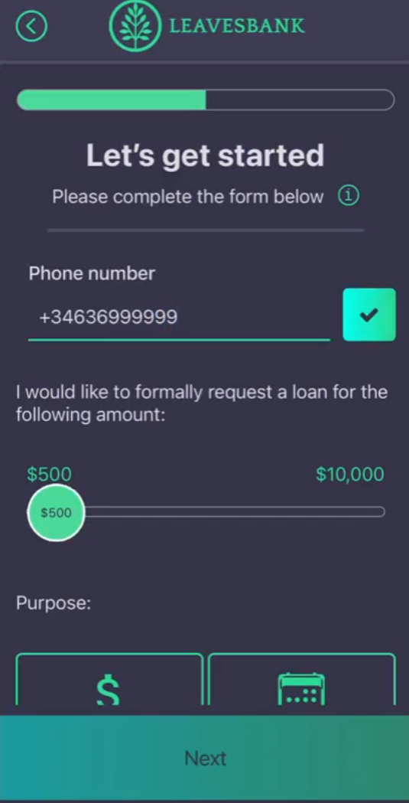
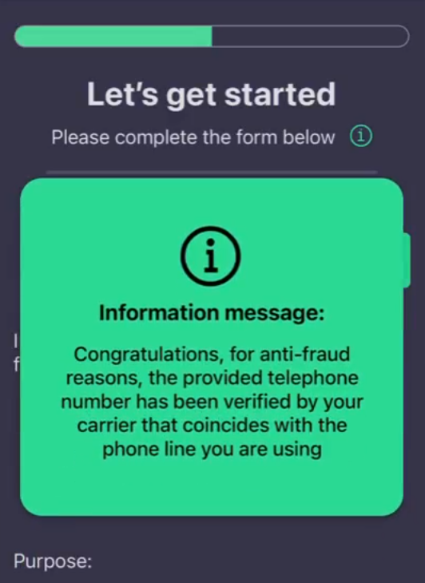
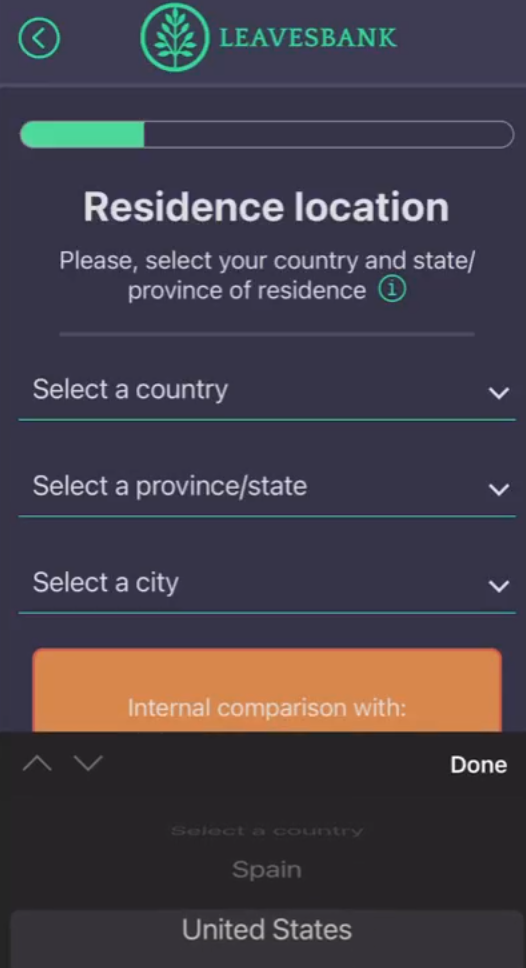
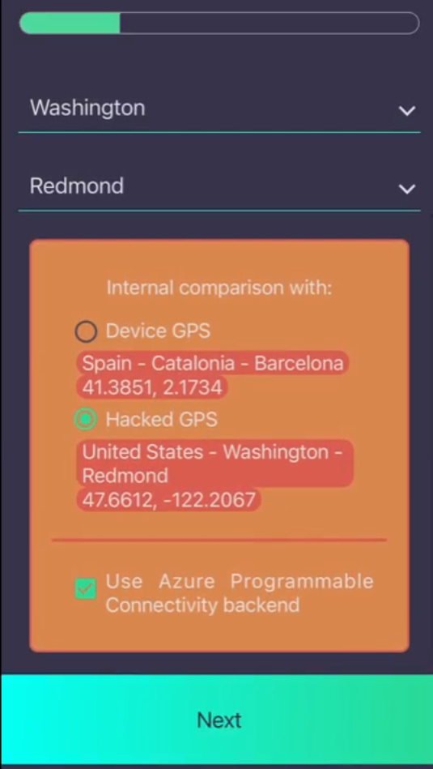
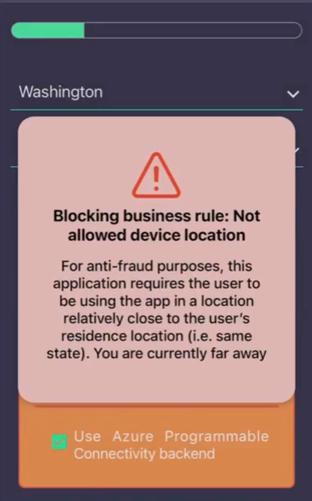
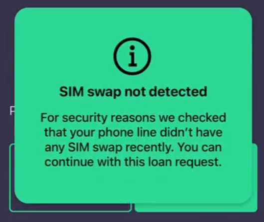
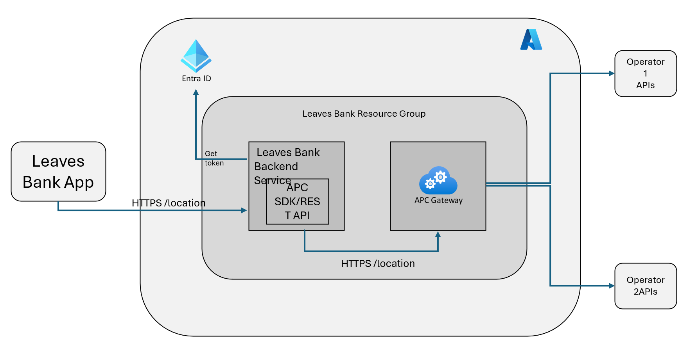

# APC-Demo-App

The Leaves Banking App is a demo application showcasing the capabilities of Azure Programmable Connectivity (APC) in the context of a micro-loan service. Designed to operate with any mobile operator supporting APC's network APIs, this app emphasizes anti-fraud features leveraging Network APIs.

## Features

### Phone Number Validation

- **Purpose**: Validates the authenticity of the phone number provided by the user.
- **How it works**: The entered phone number is verified via APC APIs and the mobile operator to ensure it is legitimate and active, preventing identity theft.

### Location Validation

- **Purpose**: Ensures that the loan application is initiated from a geographically consistent location.
- **How it works**: Users must enter their residence location, which is verified through APC network APIs to confirm the device's physical presence in the stated area or country. This feature counters potential frauds like location spoofing.

### SIM Swap Detection

- **Purpose**: Prevents fraud by detecting recent SIM swaps before processing loan applications.
- **How it works**: A security check through APC is conducted to verify if the SIM was recently swapped. If no recent swap is detected, the application process continues, ensuring the applicant's integrity.

## Application Architecture

This section provides a brief technical description of the demo application's architecture. The application is designed to interact with APC for enhanced anti-fraud security measures such as SIM swap detection, number verification, and user location verification.

### Components

#### Leaves Bank App

- **Technology**: Built using React Native and Expo Go. Runs on client devices (smartphones).
- **Features**: Interaction demo with the APCProxyServer for APC interactions.
- **Repository path**: *src/APC.MobileApp/ReactNative*

#### Leaves Bank Backend Service

- **Technology**: .NET8 Web API hosted in an Azure App Service.
- **Features**: Acts as an intermediary between the React Native app and the APC API and could host additional app logic.
- **Repository path**: *src/APC.Proxy.API*

#### APC Gateway

- **Technology**: Azure service
- **Features**: Interfaces with mobile network operator APIs.

Find detailed implementation details in this guide: [Implementation Details](implementation-details.md) or refer to the [APC Hands on Lab](./HOL/README.md).

## Get Started: Deploy and Configure Leaves Banking app

To **deploy and configure** this application refer to this guide: [Get Started](leaves-deployment.md)
