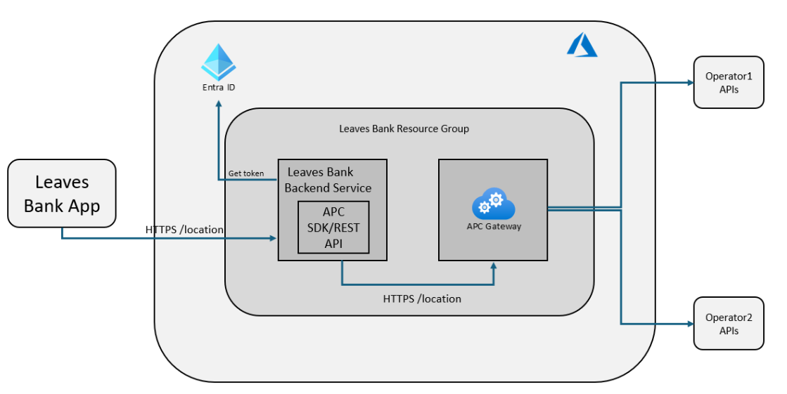

# APC-Demo-App
Mobile App with Cloud Service Demo consuming Azure Programmable Connectivity APIs with Telcos network APIs under the covers

## Architecture

This section provides a brief technical description of the demo application's architecture. The application is designed to interact with APC for enhanced anti-fraud security measures such as SIM swap detection, number verification, and user location verification.

### Components

- **Leaves Bank App**
  - **Technology**: Built using React Native and Expo Go. Runs on client devices (smartphones).
  - **Features**: Interaction demo with the APCProxyServer for APC interactions.
  - **Repository path**: *src/APC.MobileApp/ReactNative*

- **Leaves Bank Backend Service**
  - **Technology**: .NET8 Web API hosted in an Azure App Service.
  - **Features**: Acts as an intermediary between the React Native app and the APC API and could host additional app logic.
  - **Repository path**: *src/APC.Proxy.API*

- **APC Gateway**
  - **Technology**: Azure service
  - **Features**: Interfaces with mobile network operator APIs.

Find detailed implementation details in this guide: [Implementation Details](details.md) or refer to the [APC Hands on Lab](./HOL/README.md).

## Get Started

To **deploy and configure** this application refer to this guide: [Get Started](leaves-deployment.md)

