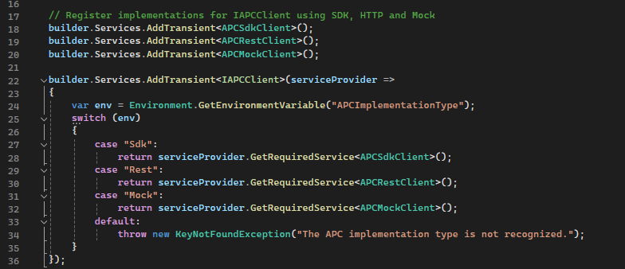

### Dependency Injection for APC SDK, HTTP Client, and MockService
We utilize dependency injection (DI) to manage different implementations of APC requests:

- **APC SDK**: Direct calls to APC using the provided SDK.
- **Rest Client**: Custom implementation with an HttpClient for more complex scenarios or where direct SDK support is limited.
- **Mock Service**: Provides preconfigured responses for testing without making actual APC calls.

This demo app implements dependency injection (DI) to handle various implementations of APC requests through a unified interface IAPCClient. This setup simplifies the process of switching between different implementations based on the environment or testing requirements. Your application may use one or more of these implementations depending on your requirements.

- Interface and Implementations:
  - **IAPCClient Interface:** Defines the contracts for all the APC Network API requests required by our application.
- Implementations:
  - **APCSdkClient:** Directly utilizes the APC SDK for making API calls.
  - **APCRestClient:** Uses a custom implementation with an HttpClient for more complex scenarios or where SDK support is limited.
  - **APCMockService:** Provides preconfigured responses for testing purposes without making actual calls to APC.

### Number Verification Process Overview

Find this information in the HOL [Number Verification Process Overview](./HOL/README/md#number-verification-process-overview)
