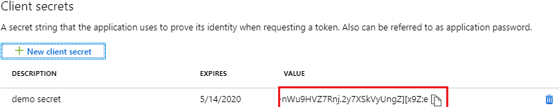

## Get Started

This section provides a step-by-step guide to get the project up and running on your local machine and mobile device.

### Prerequisites
Before starting, ensure you have the following installed:
- Git
- Node.js
- An active Azure subscription
- Azure CLI installed on your machine
- .NET SDK installed on your machine

## APC Gateway deployment and configuration

#### Create APC Gateway Instance

* Follow [this guide](https://learn.microsoft.com/azure/programmable-connectivity/azure-programmable-connectivity-create-gateway) or the one on this document to create a gateway, or have one already.
* Once you are done creating the gateway, note down the APC Gateway resoruce id endpoint, as explained in this section.

Deploying an APC Gateway in Azure is a straightforward process that involves the following steps:

1. In the Azure portal, search for **APC Gateways** and then select **Create**.

   
2. Select your **Subscription**, **Resource Group**, and **Region**.

   

3. Provide a unique **Name** for your gateway and proceed to the next steps.

Once your gateway is created, you'll need to configure it:

1. Assign the telecom operator setup, selecting the SimSwap, Location and Number Verification APIs and plans.

2. Complete the application details, which will be shared with the operator for validation.

   

3. Agree to the operators' terms and conditions to finalize the setup.

Now, note down relevant resource information for later steps:

1. Navigate to your APC Gateway resource in the Azure portal and copy the `resource Id` and the `endpoint` value:

   

#### Set up authentication

To authenticate and access the APC Gateway, create a Microsoft Entra application in the same directory or tenant.

1. Follow the instructions to [register an application with Microsoft Entra ID](https://learn.microsoft.com/en-us/entra/identity-platform/howto-create-service-principal-portal), create a service principal and record the clientId and secret.
    1. Sign in to the [Microsoft Entra admin center](https://entra.microsoft.com) as at least a **Cloud Application Administrator**. 
    1. Browse to **Identity** > **Applications** > **App registrations** then select **New registration**.
    1. Name the application, for example "apc-hol-exercise". 
    1. Select a supported account type, which determines who can use the application. For the exercises in this lab it won´t matter since we are using a client credentials flow with Client Id and secret.
    1. Select **Register**.

    

2. Create and record the application client ID and client secret or certificate for future use.
    1. Browse to **Identity** > **Applications** > **App registrations**, then select your application.
    1. Select **Certificates & secrets**.
    1. Select **Client secrets**, and then Select **New client secret**.
    1. Provide a description of the secret, and a duration.
    1. Select **Add**.

   

3. Assign the necessary role to interact with the APC Gateway to your application by running the following Azure CLI command. Replace or assign values to `$SUB_ID` with your subscription id, `RG_NAME` with resource group name where the APC Gateway resource is and `$GATEWAY_NAME` for and the APC Gateway resource name. Log in using `az login` if you have to:

```sh
az role assignment create --role 609c0c20-e0a0-4a71-b99f-e7e755ac493d
--scope /subscriptions/$SUB_ID/resourceGroups/$RG_NAME/providers/Microsoft.ProgrammableConnectivity/gateways/$GATEWAY_NAME
--assignee $APP_ID
```


## Backend configuration and deployment

### Build and configure the backend service locally

For local testing and development, you will need to update up the `appsettings.Development.json` file with the necessary configurations:

```json
{
   "APCClientSettings": {
   "AuthAppCredentials": {
      "ClientId": "your-client-id",
      "TenantId": "your-tenant-id",
      "ClientSecret": "your-client-secret"
   },
   "GatewayId": "your-gateway-id",
   "BaseUri": "https://your-apc-endpoint"
   }
}
```

Find detailed application settings in the [implementation details file](implementation-details.md)

#### Run the backend locally

1. **Navigate to the Backend Service Directory**
   ```
   cd [Repo path]/APC.Proxy.API
   ```

2. **Build the Project**
   ```
   dotnet build
   ```

3. **Run the Backend Service**
   ```
   dotnet run --project APC.ProxyServer
   ```

4. **Open the swagger UI url int the browser for testing**. Make sure the port is correct and the uri is HTTP, not HTTPS.
   
   

   ```
      http://localhost:5009/swagger/index.html
   ```

   
   
### Deploy and configure the backend in Azure Cloud

#### Step 1: Create an Azure Web App

1. **Log in to the Azure Portal** at https://portal.azure.com.
2. **Navigate to "App Services"** and click on **+ Create** to start the process of creating a new app service.

   

3. **Select your subscription** and choose or create a new resource group.
4. **Enter the name** for your web app (e.g., `apc-hol-leavesbank-service`).
5. **Publish**: Select **Code** as the method to publish the application.
6. **Runtime stack**: Choose **.NET 8**.
7. **Operating System**: Select your preferred OS (Windows or Linux).
8. **Region**: Choose the region that is closest to your users or other services.
9. **Prigcing plan**: Create or select an existing pricing plan. For development use F1 Free shared plan or better.
10. **Review and create**: Review the configuration details, then click **Create** to provision and deploy the web app.

   

#### Step 2: Configure Application Settings in Azure

1. **Navigate to your newly created App Service** in the Azure portal.
2. **Go to "Configuration"** under the Settings section and **Click on "New application setting"** to add each of the following settings. You'll need to add the relevant values for `ClientId`, `TenantId`, `ClientSecret`, `GatewayId`, and `BaseUri`:

   - `APCClientSettings__AuthAppCredentials__ClientId`
   - `APCClientSettings__AuthAppCredentials__TenantId`
   - `APCClientSettings__AuthAppCredentials__ClientSecret`
   - `APCClientSettings__GatewayId`
   - `APCClientSettings__BaseUri`

   

3. **Set CORS**: In the portal, navigate to "CORS" under the API section. Add `*` to allow all domains or specify your domain to restrict the cross-origin requests to your front end. **Save** the configurations to apply them,

   


#### Step 3: Deploy the Backend Code Using Azure CLI

Use an IDE such as [Visual Studio Code](https://learn.microsoft.com/en-us/aspnet/core/tutorials/publish-to-azure-webapp-using-vscode?view=aspnetcore-8.0#publish-to-azure), [Visual Studio](https://learn.microsoft.com/en-us/visualstudio/deployment/quickstart-deploy-aspnet-web-app?view=vs-2022&tabs=azure) or similar to deploy to the newly created web app or follow these steps to do it with Azure CLI:

1. **Set Azure Subscription.** Replace `<subscription-name-or-id>` with your actual subscription name or ID.

   ```bash
   az account set --subscription "<subscription-name-or-id>"
   ```

2. **Publish the Application.** Navigate to the directory containing the `APC.ProxyServer` project and publish it using the following command:

   ```bash
   dotnet publish ./APC.ProxyServer/APC.ProxyServer.csproj -c Release -o ./publish
   ```

This command compiles the application in the Release configuration and outputs the files to the `./publish` directory.

3. **Package the published files into a ZIP file for deployment.** Run this command in the directory where the `publish` folder is located:

   ```powershell
   Compress-Archive -Path "./publish/*" -DestinationPath "./publish.zip"
   ```

4. **Deploy to Azure WebApp**
Use the Azure CLI to upload and deploy the ZIP file to your Azure WebApp. Replace `rg-HOL-lab` with your resource group name and `apc-hol-leavesbank-service` with your WebApp name.

   ```bash
   az webapp deployment source config-zip --resource-group rg-HOL-lab --name apc-hol-leavesbank-service --src "./publish.zip"
   ```

5. Once done, **Open the swagger UI url int the browser for verification**
   ```
      https://localhost:7127/swagger/index.html
   ```


## Client app local Setup and Testing

### Build, configure and run the client app

To set up and run the project locally, follow these steps:

1. **Clone the Project**
   ```
   git clone https://github.com/MSFT-SMT-ACCELERATORS/APC-Demo-App.git
   ```

2. **Navigate to the React Native App Directory**
   ```
   cd [Repo path]/APC.MobileApp/ReactNative
   ```

3. **Install Dependencies**
   ```
   npm install
   ```

4. **Configure Environment Variables for Expo**
- Create a `.env` file in the root directory of the React Native project (*src/APC.MobileApp/ReactNative*)
- Add a variable named `API_URL` and set as value the Azure App Service uri for the backend service APC Proxy you deployed in an earlier step, or the local address for the locally running instance if you wish to test the backend locally.

  ```
  API_URL=your-app-service-uri
  ```

   

4. **Start the Application**
   ```
   npm start
   ```

6. **Open in a Web Browser**
- Once the process is complete, the Metro Bundler should be running in your terminal. Press `W` to open the app in your web browser. Use responsive mode when opening the developer console with F12.

   
   
### Run the app on Mobile

To test the app on a mobile device, follow these additional steps:

1. **Download Expo Go**
- Install the Expo Go application from your device's app store (available on iOS and Android).

2. **Scan QR Code**
- Open the Expo Go app on your mobile device.
- Select the option to scan the QR code.
- Scan the QR code that appears in your terminal after you've run `npm start` from the React Native app directory.

   
   

This will open the app on your mobile device, allowing you to test its features in a mobile environment.


### Deploy the app on App Store and Play Store (WIP)

WIP pointers

- Testflight for App Store (iOS)
- Dev acc Play Store